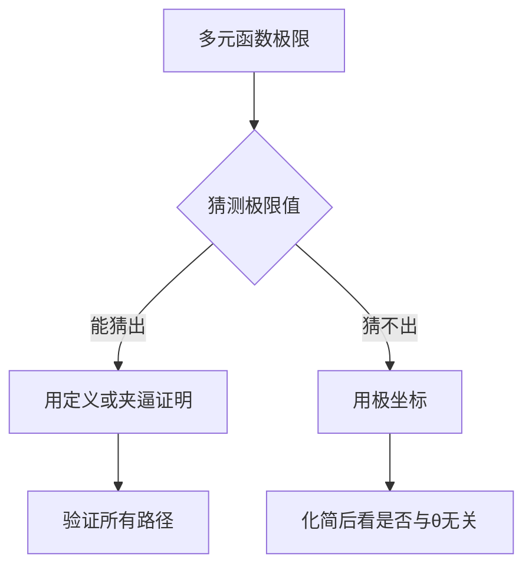
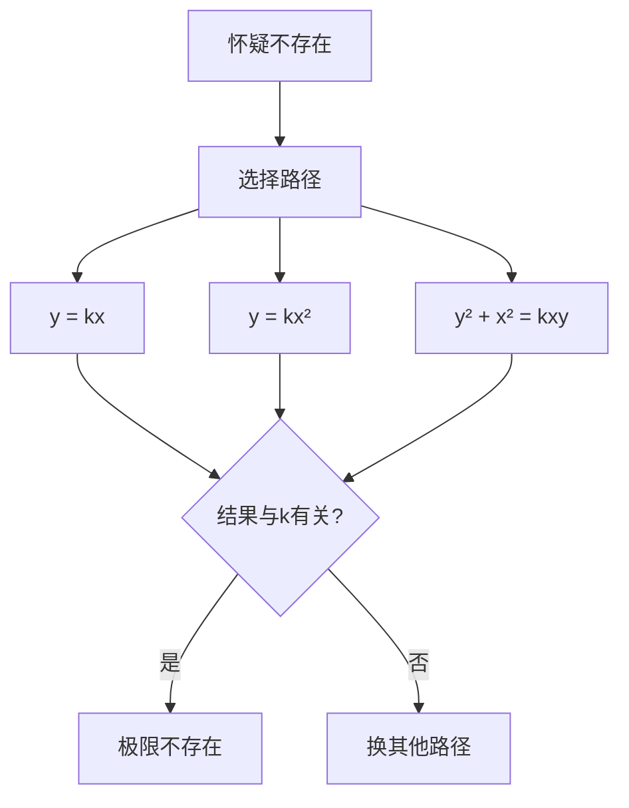

# 多元函数极限性质 - 图形化理解与例题详解

## 一、保号性的深入理解

### 🎯 核心困难：从"线"到"面"

#### 一元函数保号性（简单）
```
假设 lim f(x) = 2 > 0
      x→1

    f(x)
     ↑
   3 |     ╱╲
   2 |- - ●--●- - 极限值
   1 |   ╱    ╲
   0 |--●------●-- 
     | 0.9  1  1.1
     +------------→ x

只需保证：左右两侧 f(x) > 0
```

#### 多元函数保号性（复杂）
```
假设 lim f(x,y) = 2 > 0
    (x,y)→(0,0)

需要保证：整个圆域内 f(x,y) > 0

    y
    ↑
    |  ╱─────╲
    | │   •   │  ← 整个圆内都要>0
    |  ╲─────╱
    +----------→ x
      δ-圆域
```

### 📐 实例对比

#### 例1：成功的保号性
$$f(x,y) = 2 + x^2 + y^2$$

```
在原点附近：
- 最小值在原点：f(0,0) = 2
- 任何其他点：f(x,y) > 2
- 保号性成立！✓

立体图：
    z
    ↑   ╱╲
    |  ╱碗╲  ← 整个"碗"都在z=2上方
    | ╱形  ╲
  2 |●------
    +--------→ xy
```

#### 例2：失败的保号性
$$f(x,y) = \frac{xy}{x^2+y^2}$$

```
沿不同方向：
- 第一象限(x>0,y>0)：f > 0 ✓
- 第三象限(x<0,y<0)：f > 0 ✓
- 第二象限(x<0,y>0)：f < 0 ✗
- 第四象限(x>0,y<0)：f < 0 ✗

    y
    ↑
  + | - 
 ───┼─── 
  - | +
    +───→ x

不是所有方向都保号！
```

## 二、夹逼定理的技巧差异

### 🔧 一元函数夹逼（直接）

**标准模式**：
$$-g(x) \leq f(x) \leq g(x), \quad g(x) \to 0$$

**例**：$f(x) = x^2 \sin\frac{1}{x}$
```
因为 |sin(1/x)| ≤ 1
所以 |f(x)| ≤ x²
而 x² → 0，故 f(x) → 0
```

### 🔧 多元函数夹逼（需要技巧）

**常用不等式**：

#### 1. 算术-几何平均不等式
$$|xy| \leq \frac{x^2+y^2}{2}$$

**应用例**：
$$f(x,y) = \frac{xy}{x^2+y^2+1}$$

```
|f(x,y)| ≤ |xy|/(x²+y²) 
        ≤ (x²+y²)/(2(x²+y²))
        = 1/2

有界但这样太粗糙，更精细：
|f(x,y)| ≤ |xy| ≤ (x²+y²)/2 → 0
```

#### 2. 柯西不等式变形
$$x^4 + y^4 \geq 2x^2y^2$$

**应用例**：
$$f(x,y) = \frac{x^2y^2}{x^4+y^4}$$

```
分母：x⁴ + y⁴ ≥ 2x²y²
所以：f(x,y) ≤ x²y²/(2x²y²) = 1/2

但这只证明有界，要证明极限=0需要：
令 r² = x² + y²
|xy| ≤ r²/2
所以 |f| ≤ (r²/2)²/(r⁴/2) = r²/2 → 0
```

## 三、局部有界性的陷阱

### ⚠️ 一元函数（两侧有界即可）

```
例：f(x) = 1/x 在 x=1 附近

    f
    ↑
  2 |  ╲
    |   ╲
  1 |----●---- f(1)=1
    |     ╲
 0.5|      ╲
    +--------→ x
    0.5  1  1.5

在 [0.5, 1.5] 上有界
```

### ⚠️ 多元函数（所有方向都要有界）

**反例：看似有界实则无界**
$$f(x,y) = \frac{1}{x^2+y^4}$$

```
错误想法：x²+y⁴ ≥ 0，所以 f 有下界0 ✗

实际：沿路径 y = x^(1/2)
f = 1/(x² + x²) = 1/(2x²) → ∞ (x→0)

图示：
    z
    ↑   
    |   ╱尖╲
    |  ╱峰  ╲  ← 沿某些路径无限高！
    | │      │
    +----------→ xy
```

## 四、路径法的系统训练

### 📍 标准路径族

#### 1. 直线路径
$$y = kx \quad (k为常数)$$

适用于：分子分母同次的情况

**例**：$\lim_{(x,y)\to(0,0)} \frac{x^2-y^2}{x^2+y^2}$
```
沿 y = kx：
f = (x² - k²x²)/(x² + k²x²)
  = (1 - k²)/(1 + k²)
  
不同k值给出不同极限 → 极限不存在
```

#### 2. 抛物线路径
$$y = kx^2 \quad \text{或} \quad x = ky^2$$

适用于：分子分母次数差为2的情况

**例**：$\lim_{(x,y)\to(0,0)} \frac{xy^2}{x^2+y^4}$
```
沿 x = ky²：
f = (ky² · y²)/(k²y⁴ + y⁴)
  = ky⁴/((k²+1)y⁴)
  = k/(k²+1)
  
不同k值给出不同极限 → 极限不存在
```

#### 3. 极坐标路径
$$x = r\cos\theta, \quad y = r\sin\theta$$

适用于：证明极限存在

**例**：$\lim_{(x,y)\to(0,0)} \frac{x^3+y^3}{x^2+y^2}$
```
f = r³(cos³θ + sin³θ)/r²
  = r(cos³θ + sin³θ)
  
|f| ≤ r(|cos³θ| + |sin³θ|) ≤ 2r → 0
极限存在且为0
```

## 五、多元特有的病态例子

### 🔴 例1：偏导数存在但不连续
$$f(x,y) = \begin{cases}
\frac{xy}{x^2+y^2}, & (x,y) \neq (0,0) \\
0, & (x,y) = (0,0)
\end{cases}$$

**分析**：
```
偏导数：
fx(0,0) = lim[f(h,0)-f(0,0)]/h = 0/h = 0 ✓
fy(0,0) = lim[f(0,k)-f(0,0)]/k = 0/k = 0 ✓

连续性：
沿 y=x：f(x,x) = x²/(2x²) = 1/2 ≠ 0 = f(0,0) ✗
```

### 🔴 例2：连续但不可微
$$f(x,y) = \sqrt{|xy|}$$

**分析**：
```
连续性：
|f(x,y) - f(0,0)| = √|xy| ≤ √(x²+y²)/2 → 0 ✓

可微性：
需要检查：[f(h,k) - f(0,0) - fx·h - fy·k]/√(h²+k²) → 0

但 fx(0,0) 和 fy(0,0) 不存在！
```

## 六、解题策略总结

### 🎯 判断极限存在



### 🎯 判断极限不存在



## 七、记忆要点卡片

### 📝 性质对比速查表

| 维度 | 一元 | 多元 |
|------|------|------|
| **邻域** | 开区间 | 开圆盘 |
| **路径** | 2条(左右) | 无穷多条 |
| **极限存在** | 左=右 | 所有路径相同 |
| **保号范围** | 左右两侧 | 整个圆域 |
| **夹逼难度** | 简单 | 需要不等式技巧 |
| **反例构造** | 困难 | 容易(路径法) |

### 📝 常用极限（需要记住）

1. $\lim_{(x,y)\to(0,0)} \frac{xy}{x^2+y^2}$ 不存在
2. $\lim_{(x,y)\to(0,0)} \frac{x^2y}{x^2+y^2} = 0$
3. $\lim_{(x,y)\to(0,0)} \frac{x^2+y^2}{\sqrt{x^2+y^2}} = 0$
4. $\lim_{(x,y)\to(0,0)} \frac{\sin(xy)}{xy} = 1$（当xy≠0）

## 八、练习题（带详解）

### 题目1
判断：$\lim_{(x,y)\to(0,0)} \frac{x^2y^2}{x^2y^2+(x-y)^2}$

<details>
<summary>点击查看答案</summary>

**解**：
1. 沿 y=x：分母 = x⁴ + 0 = x⁴，极限 = 1
2. 沿 y=0：分母 = 0 + x² = x²，极限 = 0
3. 极限不存在！

</details>

### 题目2
证明：$\lim_{(x,y)\to(0,0)} \frac{x^4+y^4}{(x^2+y^2)^{3/2}} = 0$

<details>
<summary>点击查看答案</summary>

**解**：
极坐标：x=rcosθ, y=rsinθ
分子 = r⁴(cos⁴θ + sin⁴θ) ≤ r⁴·2
分母 = r³
|f| ≤ 2r → 0

</details>