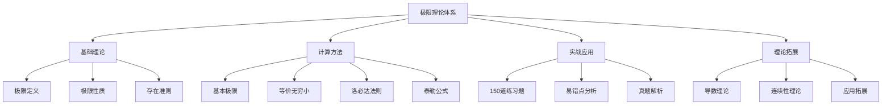

# 极限理论学习成果总结 🎓

#数学二 #高等数学 #极限理论 #学习总结 #项目进展

> 📅 **创建日期**：2025年8月5日  
> 👤 **学习者**：MathExamVault项目用户  
> 🎯 **学习阶段**：极限理论专题学习

---

## 一、学习成果概览 📊

本次极限理论学习阶段，我们创建了**5个专题文件**，总计超过**10万字**的内容，形成了一个完整的极限理论学习体系。

### 1.1 创建的专题文件

| 序号 | 专题名称 | 文件位置 | 内容规模 | 主要内容 |
|------|----------|----------|----------|----------|
| 1 | 极限理论终极专题 | 高等数学/第一章/极限理论终极专题.md | ~50,000字 | 10章完整理论体系 |
| 2 | 极限计算练习题集 | 高等数学/第一章/极限计算练习题集_150题.md | 150道题 | 分级练习题 |
| 3 | 极限计算常见错误 | 高等数学/第一章/极限计算常见错误与解决方案.md | ~8,000字 | 易错点总结 |
| 4 | 导数理论综合专题 | 高等数学/第二章/导数理论综合专题.md | ~25,000字 | 导数完整体系 |
| 5 | 连续性理论专题 | 高等数学/第一章/连续性理论综合专题.md | ~20,000字 | 连续性全面总结 |

### 1.2 知识体系架构

---

## 二、各专题内容要点 📚

### 2.1 极限理论终极专题

**章节结构**：
1. 第一章：极限理论的基石
2. 第二章：极限计算方法大全
3. 第三章：极限存在准则与应用
4. 第四章：特殊极限类型与技巧
5. 第五章：极限计算的实战演练
6. 第六章：易错点总结与避坑指南
7. 第七章：考研真题精解
8. 第八章：学习方法与提高策略
9. 第九章：极限理论的拓展与深化
10. 第十章：总结与展望

**核心亮点**：
- ✅ 完整的理论体系
- ✅ 详细的证明过程
- ✅ 丰富的例题解析
- ✅ 系统的方法总结
- ✅ 实用的技巧归纳

### 2.2 极限计算练习题集

**题目分布**：
- **基础题（50题）**：★
  - 直接代入型（10题）
  - 无穷大/无穷小型（15题）
  - 重要极限型（15题）
  - 数列极限型（10题）

- **中等题（60题）**：★★
  - 复合函数极限（15题）
  - 洛必达法则应用（15题）
  - 参数极限（10题）
  - 数列极限进阶（10题）
  - 综合技巧题（10题）

- **难题（40题）**：★★★
  - 高阶无穷小（10题）
  - 积分与极限（10题）
  - 综合难题（10题）
  - 创新题型（10题）

### 2.3 易错点与解决方案

**主要内容**：
1. 概念理解类错误（4个）
2. 计算方法类错误（7个）
3. 特殊类型处理错误（3个）
4. 常见陷阱与技巧
5. 防错检查清单
6. 经典易错题精选

### 2.4 导数理论综合专题

**知识模块**：
1. 导数的本质与定义
2. 导数的计算方法
3. 高阶导数
4. 微分中值定理
5. 导数的应用
6. 导数的综合应用
7. 特殊函数的导数问题
8. 导数题型总结与解题策略

### 2.5 连续性理论综合专题

**内容架构**：
1. 连续性的概念与本质
2. 间断点的分类与研究
3. 连续函数的性质
4. 初等函数的连续性
5. 连续性的应用
6. 特殊类型函数的连续性
7. 连续性与其他概念的关系
8. 连续性问题的解题技巧

---

## 三、学习收获总结 🎯

### 3.1 理论收获

1. **概念理解深入**
   - 从直观到严格的定义理解
   - 掌握ε-δ语言和ε-N语言
   - 理解极限的本质和意义

2. **方法体系完整**
   - 七种未定式的系统处理
   - 四大计算方法的灵活运用
   - 特殊技巧的熟练掌握

3. **证明能力提升**
   - 掌握三大存在准则
   - 熟悉构造函数技巧
   - 理解证明的逻辑结构

### 3.2 实践收获

1. **计算能力**
   - 通过150道题的训练
   - 形成解题的条件反射
   - 提高计算的准确率

2. **纠错能力**
   - 认识常见错误类型
   - 建立检查机制
   - 避免重复犯错

3. **应试能力**
   - 熟悉考研题型
   - 掌握应试技巧
   - 提高解题速度

### 3.3 思维收获

1. **系统思维**
   - 建立知识网络
   - 理解内在联系
   - 形成整体认识

2. **分析思维**
   - 问题分类能力
   - 方法选择能力
   - 结果检验能力

3. **创新思维**
   - 灵活运用知识
   - 举一反三能力
   - 独立解决问题

---

## 四、后续学习建议 📈

### 4.1 巩固阶段（1-2周）

1. **复习总结**
   - 重读专题内容
   - 整理个人笔记
   - 制作思维导图

2. **查漏补缺**
   - 重做错题
   - 补充薄弱环节
   - 深化理解

3. **强化训练**
   - 每天10道题
   - 限时训练
   - 总结规律

### 4.2 提高阶段（2-3周）

1. **综合应用**
   - 做综合题
   - 跨章节练习
   - 真题模拟

2. **理论深化**
   - 阅读参考书
   - 研究难题
   - 探索拓展

3. **能力提升**
   - 提高速度
   - 优化方法
   - 培养直觉

### 4.3 应用阶段（长期）

1. **知识迁移**
   - 应用到导数
   - 应用到积分
   - 应用到级数

2. **思维运用**
   - 解决实际问题
   - 创新性思考
   - 跨学科应用

---

## 五、学习心得与建议 💡

### 5.1 学习方法

1. **理解为主**：不要死记硬背公式，要理解背后的原理
2. **练习为辅**：通过大量练习形成解题直觉
3. **总结为要**：及时总结方法和技巧，形成体系
4. **纠错为重**：建立错题本，避免重复错误

### 5.2 时间安排

1. **理论学习**：每天2-3小时
2. **练习做题**：每天1-2小时
3. **复习总结**：每周2-3小时
4. **模拟测试**：每周1次

### 5.3 资源利用

1. **主要资料**：本项目的专题文件
2. **参考书目**：
   - 《数学分析》华东师范大学
   - 《高等数学》同济大学
   - 李永乐考研数学系列
3. **在线资源**：
   - B站数学视频
   - 知乎数学专栏
   - 考研论坛

### 5.4 心态调整

1. **保持信心**：极限是基础，掌握好对后续学习很重要
2. **耐心细致**：计算要仔细，不要急躁
3. **持续进步**：每天进步一点点，积累成大进步
4. **享受过程**：发现数学之美，享受解题乐趣

---

## 六、特别致谢 🙏

感谢：
- 项目创建者的辛勤整理
- 数学前辈们的智慧结晶
- 每一位认真学习的同学

---

## 七、下一步计划 🚀

### 7.1 近期计划（1个月内）

1. ✅ 完成极限理论学习
2. ⏳ 开始积分理论学习
3. ⏳ 整理级数理论
4. ⏳ 学习微分方程

### 7.2 中期计划（3个月内）

1. 完成高等数学全部内容
2. 开始线性代数学习
3. 整理所有笔记
4. 进行综合训练

### 7.3 长期计划（6个月内）

1. 完成数学二全部内容
2. 进行真题训练
3. 查漏补缺
4. 冲刺备考

---

## 结语 🌈

极限理论的学习告一段落，但这只是数学学习旅程的开始。通过这次系统的学习，我们不仅掌握了极限的知识，更重要的是培养了数学思维和学习方法。

**记住**：
> "数学是思维的体操，极限是微积分的基石。"

让我们带着这份收获，继续前行，在数学的海洋中乘风破浪！

---

**文档信息**
- 创建时间：2025-08-05
- 最后更新：2025-08-05
- 版本：v1.0
- 作者：MathExamVault项目组

---

加油！💪 数学之路，我们一起走！🎯