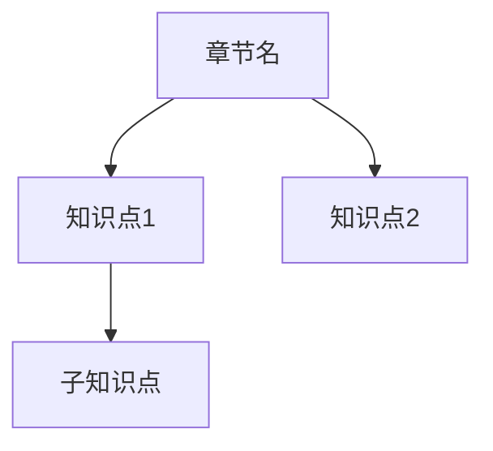

# {{章节名称}} - 学习总结

## 📊 学习进度
- **开始日期**：{{start_date}}
- **完成日期**：{{end_date}}
- **掌握程度**：⭐⭐⭐☆☆

## 🎯 本章重点

### 核心知识点
1. [[知识点1]]
2. [[知识点2]]
3. [[知识点3]]

### 重要公式
| 公式名称 | 公式内容 | 应用场景 |
|---------|---------|---------|
| | | |

### 主要定理
- 

## 📈 知识结构图

## 🔍 题型分析
| 题型 | 考频 | 难度 | 掌握情况 |
|------|------|------|----------|
| 基础概念题 | ⭐⭐⭐ | 简单 | ✅ |
| 计算题 | ⭐⭐⭐⭐⭐ | 中等 | ⚠️ |
| 证明题 | ⭐⭐ | 困难 | ❌ |

## 💭 学习心得
- 

## ❓ 待解决问题
- [ ] 
- [ ] 

## 📝 复习计划
- [ ] 第1次复习（1天后）：
- [ ] 第2次复习（3天后）：
- [ ] 第3次复习（7天后）：
- [ ] 第4次复习（15天后）：

---
标签：#章节总结 #{{章节}}
