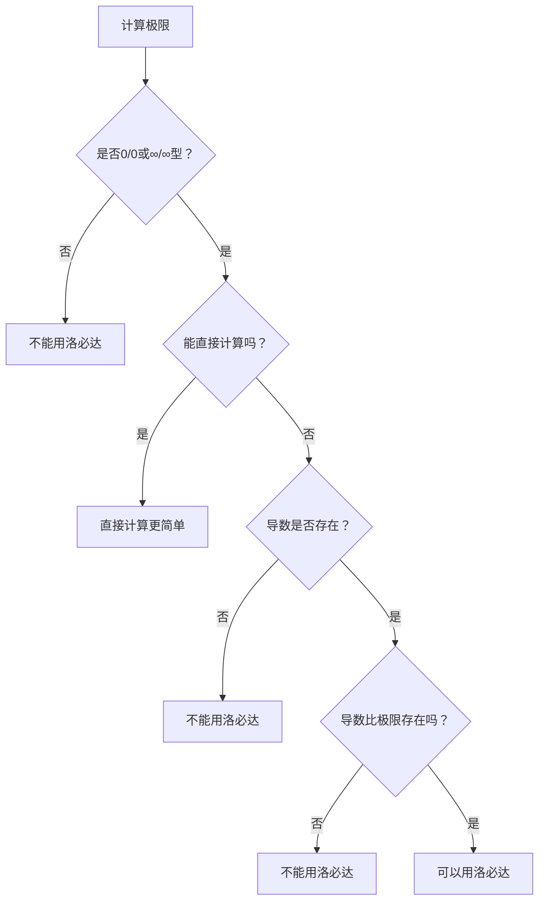

# 洛必达法则完全指南

## 📜 洛必达法则内容

若极限 $\lim_{x\to a} \frac{f(x)}{g(x)}$ 是 $\frac{0}{0}$ 或 $\frac{\infty}{\infty}$ 型不定式，且满足：
1. $f(x)$、$g(x)$ 在$a$的去心邻域内可导
2. $g'(x) \neq 0$
3. $\lim_{x\to a} \frac{f'(x)}{g'(x)}$ 存在（或为∞）

则：$\lim_{x\to a} \frac{f(x)}{g(x)} = \lim_{x\to a} \frac{f'(x)}{g'(x)}$

## ⚠️ 三个必要条件（缺一不可）

### 条件1：必须是不定式
✅ 可以用：$\frac{0}{0}$、$\frac{\infty}{\infty}$  
❌ 不能用：$\frac{1}{0}$、$\frac{0}{1}$、$\frac{2}{3}$ 等确定式

### 条件2：导数必须存在
❌ 常见导数不存在的情况：
- 含 $|x|$ 在 $x=0$ 处
- 含 $\sin\frac{1}{x}$、$\cos\frac{1}{x}$ 在 $x=0$ 处
- 分段函数在分段点

### 条件3：导数比的极限必须存在
❌ 导数比振荡的情况：
- $\lim_{x\to\infty} \frac{x+\sin x}{x}$ 用洛必达得 $\frac{1+\cos x}{1}$（振荡）
- $\lim_{x\to\infty} \frac{x+\cos x}{x+\sin x}$ 用洛必达得 $\frac{1-\sin x}{1+\cos x}$（振荡）

## 🎯 使用决策树



## 🔍 典型情况分析

### ✅ 适合用洛必达的

#### 1. 标准 $\frac{0}{0}$ 型
```
lim[x→0] (sin x - x)/x³
= lim[x→0] (cos x - 1)/(3x²)
= lim[x→0] (-sin x)/(6x)
= -1/6
```

#### 2. 标准 $\frac{\infty}{\infty}$ 型
```
lim[x→∞] ln x/x
= lim[x→∞] (1/x)/1
= 0
```

#### 3. 需要多次使用
```
lim[x→0] (eˣ - 1 - x - x²/2)/x³
需要连续使用3次洛必达
```

### ❌ 不能用洛必达的

#### 1. 导数比振荡
```
lim[x→∞] (x + sin x)/x
直接计算 = 1 + lim(sin x/x) = 1
洛必达后 = lim(1 + cos x) 不存在
```

#### 2. 导数不存在
```
lim[x→0] x²sin(1/x)/sin x
分子导数含cos(1/x)在x=0处不存在
```

#### 3. 非不定式
```
lim[x→1] (x² - 1)/(x - 2)
= 0/(-1) = 0 （不是不定式）
```

## 💡 使用技巧

### 技巧1：优先级判断
1. **最优先**：能直接算的直接算
2. **次优先**：等价无穷小替换
3. **再次**：泰勒展开
4. **最后**：洛必达法则

### 技巧2：混合使用
洛必达 + 等价无穷小：
```
lim[x→0] (tan x - sin x)/x³
= lim[x→0] sin x(1 - cos x)/(x³cos x)
≈ lim[x→0] x·(x²/2)/x³  [等价无穷小]
= 1/2
```

### 技巧3：变形后使用
有时需要先变形：
```
lim[x→0⁺] x·ln x = lim[x→0⁺] ln x/(1/x)  [∞/∞型]
= lim[x→0⁺] (1/x)/(-1/x²)
= lim[x→0⁺] (-x) = 0
```

## 🚨 常见错误

### 错误1：盲目使用
**错误**：看到分式就用洛必达  
**正确**：先判断是否为不定式

### 错误2：忽视振荡
**错误**：$\lim_{x\to\infty} \frac{x+\sin x}{x}$ 用洛必达  
**正确**：认识到导数比振荡，改用其他方法

### 错误3：不验证条件
**错误**：不检查导数是否存在  
**正确**：使用前验证三个条件

### 错误4：死循环
**错误**：洛必达后又回到原式  
**正确**：识别这种情况，改用其他方法

## 📊 快速判断表

| 极限类型 | 是否用洛必达 | 推荐方法 |
|---------|-------------|---------|
| $\frac{x+\sin x}{x}$ (x→∞) | ❌ | 直接计算 |
| $\frac{e^x-1}{x}$ (x→0) | ✅ | 洛必达或等价 |
| $\frac{\sin x - x}{x^3}$ (x→0) | ✅ | 洛必达或泰勒 |
| $\frac{x^2\sin\frac{1}{x}}{\sin x}$ (x→0) | ❌ | 有界性 |
| $\frac{\ln x}{x}$ (x→∞) | ✅ | 洛必达 |
| $\frac{1-\cos x}{x^2}$ (x→0) | ✅ | 洛必达或等价 |

## 🎓 记忆口诀
```
洛必达，三条件：
不定式，导存在，
导比限，要收敛。
能直算，不要变，
会振荡，快撤退。
```

## 📝 总结
1. **洛必达不是首选**，是备选
2. **三个条件**缺一不可
3. **振荡函数**是最大陷阱
4. 熟练掌握后，大部分题目一眼就能判断是否适用

---
#高数/极限与连续 #洛必达法则 #技巧总结 #易错点