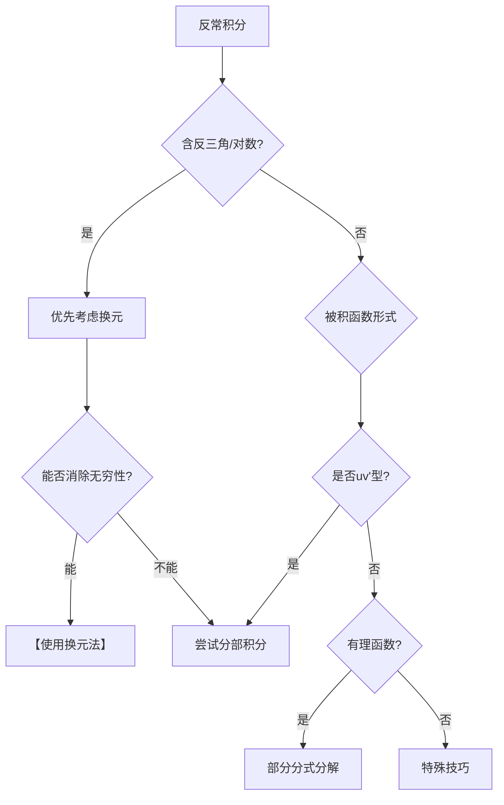

# 反常积分解法策略 - 换元法的优先级分析

## 一、换元法在反常积分中的独特优势

### 1. 核心优势：化无穷为有限

**本题实例分析**：
$$\int_1^{+\infty} \frac{\arctan x}{x^2} dx$$

**换元**：令 $\arctan x = t$
- $x = \tan t$，$dx = \sec^2 t \, dt$
- $x = 1 \Rightarrow t = \frac{\pi}{4}$
- $x \to +\infty \Rightarrow t \to \frac{\pi}{2}$

**神奇转化**：
$$\int_1^{+\infty} \frac{\arctan x}{x^2} dx = \int_{\pi/4}^{\pi/2} \frac{t}{\tan^2 t} \cdot \sec^2 t \, dt = \int_{\pi/4}^{\pi/2} t \csc^2 t \, dt$$

✨ **关键点**：无穷限积分变成了有限区间 $[\frac{\pi}{4}, \frac{\pi}{2}]$ 的积分！

### 2. 换元法的三大优势

| 优势 | 说明 | 适用情况 |
|-----|------|---------|
| **消除无穷性** | 将 $\infty$ 变为有限值 | 含反三角函数、对数函数 |
| **消除瑕点** | 将奇点移到边界或消失 | $\frac{1}{\sqrt{x}}$ 型瑕积分 |
| **简化被积函数** | 复杂函数变简单 | 复合函数结构 |

---

## 二、换元法优先级判断准则

### 🎯 优先使用换元法的标志

#### 1. 含反三角函数的反常积分
**特征**：被积函数含 $\arctan x$, $\arcsin x$ 等

**例**：$\int_0^{+\infty} \frac{\arctan x}{1+x^2} dx$

令 $\arctan x = t$：
- $x: 0 \to +\infty$ 变为 $t: 0 \to \frac{\pi}{2}$
- 积分变为 $\int_0^{\pi/2} t \, dt = \frac{\pi^2}{8}$

#### 2. 含指数/对数的无穷积分
**特征**：$e^x$, $\ln x$ 与有理函数结合

**例**：$\int_0^{+\infty} \frac{1}{e^x + 1} dx$

令 $e^x = t$：
- $x: 0 \to +\infty$ 变为 $t: 1 \to +\infty$
- 但积分变为 $\int_1^{+\infty} \frac{1}{t(t+1)} dt = \ln 2$（更简单）

#### 3. 根式型瑕积分
**特征**：$\sqrt{x}$, $\sqrt{1-x^2}$ 等

**例**：$\int_0^1 \frac{1}{\sqrt{x}(1+x)} dx$

令 $x = t^2$：
- 消除了根号和瑕点
- 积分变为 $\int_0^1 \frac{2}{1+t^2} dt = \frac{\pi}{2}$
---

## 三、换元法 vs 分部积分法 对比

### 本题两种方法对比

| 方法 | 计算难度 | 关键步骤 | 优缺点 |
|------|---------|---------|--------|
| **分部积分** | 中等 | 处理 $\ln b - \frac{1}{2}\ln(1+b^2)$ 的极限 | 需要仔细处理∞-∞型极限 |
| **换元法** | 简单 | 转化为有限区间积分 | 避免了极限计算的复杂性 |

### 深层分析：为什么换元法更优？

1. **避免了不定式**
   - 分部积分：需处理 $\lim_{b\to\infty}[\ln b - \ln\sqrt{1+b^2}]$ 
   - 换元法：直接在有限区间 $[\frac{\pi}{4}, \frac{\pi}{2}]$ 计算

2. **计算更直接**
   - 换元后的 $\int t\csc^2 t \, dt$ 是标准的分部积分
   - 上下限都是具体数值，无需求极限

3. **不易出错**
   - 有限区间积分不会遗漏极限过程
   - 计算步骤更加程式化

---

## 四、反常积分解法优先级策略 🎯

### 优先级排序（从高到低）

```
1. 特殊换元法（能消除反常性）
   ↓
2. 标准换元法（简化被积函数）
   ↓
3. 分部积分法（直接计算）
   ↓
4. 其他方法（级数、留数等）
```

### 决策流程图



---

## 五、经典换元模式总结

### 1. 反三角函数换元

| 原函数含有 | 换元方式 | 效果 |
|-----------|---------|------|
| $\arctan x$ | $t = \arctan x$ | $x \in [0,+\infty) \to t \in [0,\frac{\pi}{2})$ |
| $\arcsin x$ | $t = \arcsin x$ | $x \in [0,1] \to t \in [0,\frac{\pi}{2}]$ |
| $\arctan \frac{1}{x}$ | $t = \arctan \frac{1}{x}$ | $x \in (0,+\infty) \to t \in (0,\frac{\pi}{2})$ |

### 2. 指数对数换元

| 积分类型 | 换元方式 | 典型例子 |
|---------|---------|---------|
| $\int_0^{+\infty} f(e^x)dx$ | $t = e^x$ | $\int_0^{+\infty} \frac{1}{e^x+1}dx$ |
| $\int_1^{+\infty} f(\ln x) \frac{dx}{x}$ | $t = \ln x$ | $\int_1^{+\infty} \frac{\ln x}{x^2}dx$ |
| $\int_0^1 f(-\ln x)dx$ | $t = -\ln x$ | $\int_0^1 \sqrt{-\ln x}dx$ |

### 3. 三角换元（化无穷为有限）

| 积分区间 | 换元 | 新区间 |
|---------|------|--------|
| $[0, +\infty)$ | $x = \tan t$ | $[0, \frac{\pi}{2})$ |
| $(-\infty, +\infty)$ | $x = \tan t$ | $(-\frac{\pi}{2}, \frac{\pi}{2})$ |
| $[1, +\infty)$ | $x = \sec t$ | $[0, \frac{\pi}{2})$ |

---

## 六、实战例题分析

### 例1：优先换元的典型
$$\int_0^{+\infty} \frac{\arctan x}{(1+x^2)^{3/2}} dx$$

**分析**：含 $\arctan x$，优先换元！
- 令 $x = \tan t$
- 积分变为 $\int_0^{\pi/2} \frac{t}{\sec^3 t} \cdot \sec^2 t \, dt = \int_0^{\pi/2} t\cos t \, dt$
- 简单分部积分即可

### 例2：分部积分更好的情况
$$\int_1^{+\infty} \frac{\ln x}{x^3} dx$$

**分析**：虽含 $\ln x$，但直接分部积分更简单
- $u = \ln x, dv = x^{-3}dx$
- 一步到位，无需换元

### 例3：换元化瑕点
$$\int_0^1 \frac{\ln(1-x)}{\sqrt{x}} dx$$

**分析**：$x=0$ 是瑕点
- 令 $x = t^2$
- 瑕点消失，积分变为 $2\int_0^1 \ln(1-t^2) dt$
---

## 七、考试实战策略 📝

### 快速判断口诀

**"反三对指根，换元第一冲"**
- **反三**：反三角函数 → 换元优先
- **对指**：对数、指数函数 → 考虑换元
- **根**：根式瑕点 → 换元消除

### 30秒决策法

1. **扫描被积函数**（5秒）
   - 有无反三角函数？
   - 有无 $e^x, \ln x$？
   - 有无根式？

2. **检查积分限**（5秒）
   - 无穷限？→ 能否换元化为有限
   - 瑕点？→ 能否换元消除

3. **预估换元效果**（10秒）
   - 换元后会更简单吗？
   - 新的积分限是什么？

4. **对比其他方法**（10秒）
   - 分部积分需要几步？
   - 有无更直接的方法？

---

## 八、易错提醒 ⚠️

### 1. 换元时的常见错误

❌ **忘记改变积分限**
```
错误：∫[1,∞] f(x)dx，令x=tant
仍用 [1,∞] 作为t的范围
```

✅ **正确做法**
```
x=1 时，t=π/4
x→∞ 时，t→π/2
新积分限：[π/4, π/2)
```

### 2. 反函数换元的陷阱

❌ **定义域问题**
```
∫[0,2] arcsin x dx
令 t = arcsin x 时要注意 x∈[-1,1]
原积分上限2超出定义域！
```

### 3. 换元后仍是反常积分

⚠️ **并非所有换元都能消除反常性**
```
∫[0,∞] 1/(1+x²) dx
令 x = tan t 后：∫[0,π/2] dt
注意：t=π/2 时 tan t = ∞（仍需小心处理）
```

---

## 九、总结：换元法的战略地位 🎯

### 核心结论

> **对于反常积分，换元法确实应该具有更高的优先级！**

### 理由总结

1. **降维打击**：将反常积分降为正常积分
2. **避免极限**：无需处理复杂的极限过程
3. **计算简化**：往往能显著简化被积函数
4. **减少错误**：有限区间计算更不易出错

### 实用建议

```
遇到反常积分的思考顺序：

1️⃣ 先看能否换元消除反常性
2️⃣ 若不能，看换元能否简化被积函数
3️⃣ 若换元无效，再考虑分部积分
4️⃣ 最后考虑其他特殊方法
```

---

## 十、练习题（带解答提示）

### 练习1
$$\int_1^{+\infty} \frac{\arctan x}{x^{3/2}} dx$$

**提示**：令 $\arctan x = t$，类似本题

### 练习2
$$\int_0^{+\infty} \frac{x}{(1+x^2)^2} dx$$

**提示**：令 $u = 1+x^2$ 或 $x = \tan t$

### 练习3
$$\int_0^1 \frac{\ln(1+x)}{1+x^2} dx$$

**提示**：这题换元反而复杂，用级数展开更好

### 练习4
$$\int_0^{\pi/2} \ln(\sin x) dx$$

**提示**：经典积分，对称性技巧，答案 $-\frac{\pi}{2}\ln 2$

---

## 📌 终极总结

### 换元法在反常积分中的地位

```
🥇 黄金法则：
当反常积分含有反三角函数、对数、指数或根式时，
换元法应作为首选方法！

特别是当换元能将：
• 无穷限 → 有限区间
• 瑕点 → 正常点
• 复杂函数 → 简单函数

这时换元法具有压倒性优势！
```

### 您的直觉是对的！

您提到的"换元法可以把上下限有概率改变，使得其变成非反常积分"，这正是换元法在处理反常积分时的**核心优势**。

在考试中，看到反常积分，特别是含反三角函数的，**第一反应应该是尝试换元**，而不是直接分部积分。这个思维习惯会让您在解题时事半功倍！

---
*创建时间：2025-01-18*
*标签：#反常积分 #换元法 #分部积分 #解题策略 #优先级*