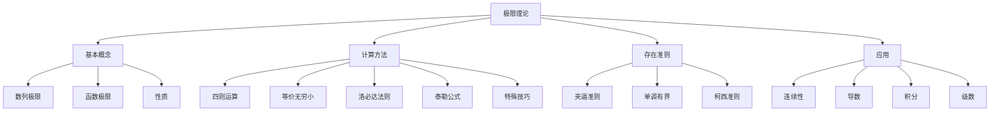

# 极限理论综合专题大全 🚀

#数学二 #高等数学 #极限理论 #综合专题 #重点掌握 #考研必备

> 本专题是极限理论的百科全书式总结，涵盖了从基础概念到高级技巧的所有内容。建议收藏并反复研读！

## 目录导航 📑

[TOC]

## 第一部分：极限的基础理论 🏗️

### 1.1 极限的本质理解

#### 什么是极限？
极限是描述函数在某一点附近或趋于无穷时的变化趋势的数学工具。它回答了"当自变量无限接近某个值时，函数值会趋向什么"这个问题。

#### 极限的直观理解
1. **趋近但不一定到达**：$\lim_{x \to 2} \frac{x^2 - 4}{x - 2} = 4$，函数在 $x = 2$ 处无定义，但极限存在
2. **从任意方向趋近**：函数极限要求从左右两侧趋近时极限值相同
3. **稳定性**：无论多么接近，函数值都稳定在极限值附近

### 1.2 数列极限的严格定义

#### ε-N 定义
对于数列 $\{a_n\}$，如果对任意 $\varepsilon > 0$，存在正整数 $N$，使得当 $n > N$ 时，恒有 $|a_n - A| < \varepsilon$，则称 $A$ 为数列 $\{a_n\}$ 的极限，记作：
$$\lim_{n \to \infty} a_n = A$$

#### 定义的几何意义
- 给定任意小的正数 $\varepsilon$（误差范围）
- 总能找到某一项 $N$，从第 $N+1$ 项开始
- 所有项都落在区间 $(A - \varepsilon, A + \varepsilon)$ 内

#### 例题解析
**例1**：用定义证明 $\lim_{n \to \infty} \frac{n + 1}{n} = 1$

**证明**：
要证明对任意 $\varepsilon > 0$，存在 $N$，当 $n > N$ 时，$\left|\frac{n + 1}{n} - 1\right| < \varepsilon$

计算：$\left|\frac{n + 1}{n} - 1\right| = \left|\frac{1}{n}\right| = \frac{1}{n}$

要使 $\frac{1}{n} < \varepsilon$，只需 $n > \frac{1}{\varepsilon}$

因此取 $N = \left[\frac{1}{\varepsilon}\right] + 1$，当 $n > N$ 时，有：
$$\left|\frac{n + 1}{n} - 1\right| = \frac{1}{n} < \frac{1}{N} < \varepsilon$$

### 1.3 函数极限的定义

#### ε-δ 定义（$x \to x_0$）
设函数 $f(x)$ 在点 $x_0$ 的某去心邻域内有定义。如果对任意 $\varepsilon > 0$，存在 $\delta > 0$，使得当 $0 < |x - x_0| < \delta$ 时，恒有 $|f(x) - A| < \varepsilon$，则称 $A$ 为 $f(x)$ 当 $x \to x_0$ 时的极限，记作：
$$\lim_{x \to x_0} f(x) = A$$

#### ε-M 定义（$x \to \infty$）
如果对任意 $\varepsilon > 0$，存在 $M > 0$，使得当 $|x| > M$ 时，恒有 $|f(x) - A| < \varepsilon$，则称 $A$ 为 $f(x)$ 当 $x \to \infty$ 时的极限。

#### 单侧极限
- 左极限：$\lim_{x \to x_0^-} f(x) = f(x_0^-)$
- 右极限：$\lim_{x \to x_0^+} f(x) = f(x_0^+)$
- 极限存在的充要条件：$f(x_0^-) = f(x_0^+)$

### 1.4 极限的性质

#### 1. 唯一性
若极限存在，则极限值唯一。

**证明要点**：反证法，假设有两个不同的极限值，导出矛盾。

#### 2. 局部有界性
若 $\lim_{x \to x_0} f(x) = A$，则 $f(x)$ 在 $x_0$ 的某去心邻域内有界。

**应用**：判断函数的有界性，估计函数值的范围。

#### 3. 局部保号性
若 $\lim_{x \to x_0} f(x) = A > 0$（或 $< 0$），则存在 $x_0$ 的某去心邻域，在该邻域内 $f(x) > 0$（或 $< 0$）。

**逆命题的反例**：$f(x) = x^2 > 0$，但 $\lim_{x \to 0} f(x) = 0$

#### 4. 夹逼性
若在 $x_0$ 的某去心邻域内，$g(x) \leq f(x) \leq h(x)$，且 $\lim_{x \to x_0} g(x) = \lim_{x \to x_0} h(x) = A$，则 $\lim_{x \to x_0} f(x) = A$。

## 第二部分：极限的计算方法大全 🧮

### 2.1 基本极限公式

#### 常用极限值表

| 极限形式 | 极限值 | 条件 | 记忆技巧 |
|---------|--------|------|----------|
| $\lim_{x \to 0} \frac{\sin x}{x}$ | $1$ | - | 第一重要极限 |
| $\lim_{x \to 0} \frac{\tan x}{x}$ | $1$ | - | 由 $\tan x = \frac{\sin x}{\cos x}$ |
| $\lim_{x \to 0} \frac{1 - \cos x}{x^2}$ | $\frac{1}{2}$ | - | 泰勒展开的结果 |
| $\lim_{x \to 0} \frac{\arcsin x}{x}$ | $1$ | - | 反函数性质 |
| $\lim_{x \to 0} \frac{\arctan x}{x}$ | $1$ | - | 反函数性质 |
| $\lim_{x \to 0} \frac{e^x - 1}{x}$ | $1$ | - | 指数函数基本极限 |
| $\lim_{x \to 0} \frac{\ln(1 + x)}{x}$ | $1$ | - | 对数函数基本极限 |
| $\lim_{x \to 0} \frac{a^x - 1}{x}$ | $\ln a$ | $a > 0, a \neq 1$ | 换底公式 |
| $\lim_{x \to 0} \frac{(1 + x)^\alpha - 1}{x}$ | $\alpha$ | - | 幂函数基本极限 |
| $\lim_{x \to \infty} \left(1 + \frac{1}{x}\right)^x$ | $e$ | - | 第二重要极限 |
| $\lim_{x \to 0} (1 + x)^{\frac{1}{x}}$ | $e$ | - | 第二重要极限变形 |
| $\lim_{n \to \infty} \sqrt[n]{n}$ | $1$ | - | 根式极限 |
| $\lim_{n \to \infty} \sqrt[n]{a}$ | $1$ | $a > 0$ | 根式极限 |
| $\lim_{n \to \infty} \frac{n!}{n^n}$ | $0$ | - | 阶乘增长 |
| $\lim_{n \to \infty} \frac{a^n}{n!}$ | $0$ | $a$ 为常数 | 指数vs阶乘 |

### 2.2 四则运算法则

若 $\lim f(x) = A$，$\lim g(x) = B$，则：

1. **加减法则**：$\lim [f(x) \pm g(x)] = A \pm B$
2. **乘法法则**：$\lim [f(x) \cdot g(x)] = A \cdot B$
3. **除法法则**：$\lim \frac{f(x)}{g(x)} = \frac{A}{B}$（$B \neq 0$）
4. **幂法则**：$\lim [f(x)]^{g(x)} = A^B$（$A > 0$）

**注意事项**：
- 法则的前提是各个极限都存在且有限
- 遇到 $\infty - \infty$、$0 \cdot \infty$、$\frac{0}{0}$、$\frac{\infty}{\infty}$、$1^\infty$、$\infty^0$、$0^0$ 等未定式时，不能直接用四则运算

### 2.3 等价无穷小替换

#### 常用等价无穷小（当 $x \to 0$ 时）

**三角函数类**：
- $\sin x \sim x$
- $\tan x \sim x$
- $\arcsin x \sim x$
- $\arctan x \sim x$
- $1 - \cos x \sim \frac{x^2}{2}$
- $x - \sin x \sim \frac{x^3}{6}$
- $\tan x - x \sim \frac{x^3}{3}$
- $x - \arctan x \sim \frac{x^3}{3}$

**指数对数类**：
- $e^x - 1 \sim x$
- $a^x - 1 \sim x \ln a$（$a > 0, a \neq 1$）
- $\ln(1 + x) \sim x$
- $(1 + x)^\alpha - 1 \sim \alpha x$

**高阶等价无穷小**：
- $\sin x - x \sim -\frac{x^3}{6}$
- $\cos x - 1 + \frac{x^2}{2} \sim -\frac{x^4}{24}$
- $e^x - 1 - x \sim \frac{x^2}{2}$
- $\ln(1 + x) - x \sim -\frac{x^2}{2}$

#### 等价无穷小替换原则

**可以替换的情况**：
1. 乘除关系中的因子
2. 加减关系中，当两项不会相消时

**不能替换的情况**：
1. 加减关系中可能相消的项
2. 复合函数的内层函数（除非外层函数是线性的）

**错误示例**：
❌ $\lim_{x \to 0} \frac{\sin x - x}{x^3}$ 不能将 $\sin x$ 替换为 $x$
✓ 正确做法：$\sin x - x \sim -\frac{x^3}{6}$

### 2.4 泰勒公式在极限计算中的应用

#### 常用泰勒展开式（在 $x = 0$ 处）

**基本函数的泰勒展开**：

$$e^x = 1 + x + \frac{x^2}{2!} + \frac{x^3}{3!} + \cdots + \frac{x^n}{n!} + o(x^n)$$

$$\sin x = x - \frac{x^3}{3!} + \frac{x^5}{5!} - \frac{x^7}{7!} + \cdots + (-1)^n \frac{x^{2n+1}}{(2n+1)!} + o(x^{2n+1})$$

$$\cos x = 1 - \frac{x^2}{2!} + \frac{x^4}{4!} - \frac{x^6}{6!} + \cdots + (-1)^n \frac{x^{2n}}{(2n)!} + o(x^{2n})$$

$$\ln(1 + x) = x - \frac{x^2}{2} + \frac{x^3}{3} - \frac{x^4}{4} + \cdots + (-1)^{n-1} \frac{x^n}{n} + o(x^n)$$

$$(1 + x)^\alpha = 1 + \alpha x + \frac{\alpha(\alpha-1)}{2!} x^2 + \cdots + \frac{\alpha(\alpha-1)\cdots(\alpha-n+1)}{n!} x^n + o(x^n)$$

$$\tan x = x + \frac{x^3}{3} + \frac{2x^5}{15} + \frac{17x^7}{315} + \cdots$$

$$\arctan x = x - \frac{x^3}{3} + \frac{x^5}{5} - \frac{x^7}{7} + \cdots$$

$$\arcsin x = x + \frac{x^3}{6} + \frac{3x^5}{40} + \frac{5x^7}{112} + \cdots$$

#### 泰勒公式使用技巧

**1. 确定展开阶数**
- 分子分母同阶原则
- 加减运算中保留到不相消的最低阶

**2. 组合函数的展开**
- 先展开内层，再代入外层
- 注意保留足够的项数

**例题**：计算 $\lim_{x \to 0} \frac{e^{\sin x} - e^x}{x^3}$

**解**：
$$\sin x = x - \frac{x^3}{6} + o(x^3)$$

$$e^{\sin x} = e^{x - \frac{x^3}{6} + o(x^3)} = e^x \cdot e^{-\frac{x^3}{6} + o(x^3)}$$

$$= e^x \left(1 - \frac{x^3}{6} + o(x^3)\right)$$

$$= e^x - \frac{x^3 e^x}{6} + o(x^3)$$

又 $e^x = 1 + x + \frac{x^2}{2} + \frac{x^3}{6} + o(x^3)$

所以：
$$e^{\sin x} - e^x = -\frac{x^3}{6}(1 + x + \frac{x^2}{2} + o(x^2)) = -\frac{x^3}{6} + o(x^3)$$

因此：$\lim_{x \to 0} \frac{e^{\sin x} - e^x}{x^3} = -\frac{1}{6}$

### 2.5 洛必达法则

#### 法则内容

**定理**：设函数 $f(x)$、$g(x)$ 满足：
1. $\lim_{x \to x_0} f(x) = \lim_{x \to x_0} g(x) = 0$（或都为 $\infty$）
2. 在 $x_0$ 的某去心邻域内，$f'(x)$、$g'(x)$ 存在且 $g'(x) \neq 0$
3. $\lim_{x \to x_0} \frac{f'(x)}{g'(x)}$ 存在（或为 $\infty$）

则：$\lim_{x \to x_0} \frac{f(x)}{g(x)} = \lim_{x \to x_0} \frac{f'(x)}{g'(x)}$

#### 适用的未定式类型

**直接适用**：
- $\frac{0}{0}$ 型
- $\frac{\infty}{\infty}$ 型

**需要转化**：
- $0 \cdot \infty$ 型：转化为 $\frac{0}{\frac{1}{\infty}}$ 或 $\frac{\infty}{\frac{1}{0}}$
- $\infty - \infty$ 型：通分或有理化
- $1^\infty$、$\infty^0$、$0^0$ 型：取对数

#### 洛必达法则的使用技巧

**1. 验证条件**
- 确认是未定式
- 检查导数是否存在

**2. 简化技巧**
- 先化简再用洛必达
- 结合等价无穷小
- 适时停止（不是所有题都要一直用下去）

**3. 常见错误**
- 不是未定式就使用
- 分子分母分别求极限
- 无限使用导致循环

**例题**：计算 $\lim_{x \to 0} \frac{x - \sin x}{x^3}$

**解法1**（洛必达）：
$$\lim_{x \to 0} \frac{x - \sin x}{x^3} = \lim_{x \to 0} \frac{1 - \cos x}{3x^2} = \lim_{x \to 0} \frac{\sin x}{6x} = \frac{1}{6}$$

**解法2**（泰勒展开）：
$$x - \sin x = x - (x - \frac{x^3}{6} + o(x^3)) = \frac{x^3}{6} + o(x^3)$$

所以原极限 $= \frac{1}{6}$

### 2.6 极限存在准则

#### 1. 夹逼准则

**应用场景**：
- 求和式极限
- 含有三角函数的极限
- 根式极限

**典型例题**：求 $\lim_{n \to \infty} \sum_{k=1}^n \frac{1}{\sqrt{n^2 + k}}$

**解**：
注意到：
$$\frac{n}{\sqrt{n^2 + n}} \leq \sum_{k=1}^n \frac{1}{\sqrt{n^2 + k}} \leq \frac{n}{\sqrt{n^2 + 1}}$$

计算两端极限：
$$\lim_{n \to \infty} \frac{n}{\sqrt{n^2 + n}} = \lim_{n \to \infty} \frac{1}{\sqrt{1 + \frac{1}{n}}} = 1$$

$$\lim_{n \to \infty} \frac{n}{\sqrt{n^2 + 1}} = \lim_{n \to \infty} \frac{1}{\sqrt{1 + \frac{1}{n^2}}} = 1$$

由夹逼准则，原极限 = 1。

#### 2. 单调有界准则

**应用步骤**：
1. 证明单调性（递增或递减）
2. 证明有界性（上界或下界）
3. 确定极限存在
4. 求极限值（通常通过递推关系）

**例题**：设 $x_1 = \sqrt{2}$，$x_{n+1} = \sqrt{2 + x_n}$，求 $\lim_{n \to \infty} x_n$

**解**：
1. **有界性**：数学归纳法证明 $0 < x_n < 2$
2. **单调性**：$x_{n+1}^2 - x_n^2 = 2 + x_n - x_n^2 = x_n(2 - x_n) > 0$
3. **极限存在**：单调递增有上界
4. **求极限**：设 $\lim_{n \to \infty} x_n = A$，则 $A = \sqrt{2 + A}$，解得 $A = 2$

#### 3. 柯西收敛准则

数列收敛的充要条件：对任意 $\varepsilon > 0$，存在 $N$，当 $m, n > N$ 时，$|a_m - a_n| < \varepsilon$

**应用**：主要用于证明数列发散（通过否定）

### 2.7 特殊技巧

#### 1. 有理化技巧

**适用情况**：含有根式的差

**例题**：$\lim_{x \to \infty} (\sqrt{x^2 + x} - x)$

**解**：
$$\sqrt{x^2 + x} - x = \frac{(\sqrt{x^2 + x} - x)(\sqrt{x^2 + x} + x)}{\sqrt{x^2 + x} + x} = \frac{x}{\sqrt{x^2 + x} + x}$$

当 $x \to +\infty$ 时：
$$= \frac{x}{x(\sqrt{1 + \frac{1}{x}} + 1)} = \frac{1}{\sqrt{1 + \frac{1}{x}} + 1} \to \frac{1}{2}$$

#### 2. 换元法

**常用换元**：
- $t = \frac{1}{x}$（当 $x \to \infty$）
- $t = x - x_0$（当 $x \to x_0$）
- $t = \sqrt[n]{x}$（处理根式）

**例题**：$\lim_{x \to +\infty} x \sin \frac{1}{x}$

**解**：令 $t = \frac{1}{x}$，当 $x \to +\infty$ 时，$t \to 0^+$

原极限 $= \lim_{t \to 0^+} \frac{\sin t}{t} = 1$

#### 3. 取对数法

**适用情况**：幂指函数 $u(x)^{v(x)}$

**步骤**：
1. 设 $y = u(x)^{v(x)}$
2. 取对数：$\ln y = v(x) \ln u(x)$
3. 求 $\lim \ln y$
4. 原极限 $= e^{\lim \ln y}$

**例题**：$\lim_{x \to 0^+} x^x$

**解**：
$$\ln(x^x) = x \ln x$$

$$\lim_{x \to 0^+} x \ln x = \lim_{x \to 0^+} \frac{\ln x}{\frac{1}{x}} = \lim_{x \to 0^+} \frac{\frac{1}{x}}{-\frac{1}{x^2}} = \lim_{x \to 0^+} (-x) = 0$$

因此：$\lim_{x \to 0^+} x^x = e^0 = 1$

## 第三部分：极限计算的题型分类 📊

### 3.1 $\frac{0}{0}$ 型未定式

#### 方法优先级
1. 等价无穷小替换
2. 洛必达法则
3. 泰勒公式
4. 有理化（含根式时）

#### 典型例题汇总

**例1**：$\lim_{x \to 0} \frac{\sin x - \tan x}{x^3}$

**解法1**（等价无穷小）：
$$\sin x - \tan x = \sin x - \frac{\sin x}{\cos x} = \sin x \cdot \frac{\cos x - 1}{\cos x}$$

当 $x \to 0$ 时：
- $\sin x \sim x$
- $\cos x - 1 \sim -\frac{x^2}{2}$
- $\cos x \to 1$

所以：$\sin x - \tan x \sim x \cdot \frac{-\frac{x^2}{2}}{1} = -\frac{x^3}{2}$

原极限 $= \lim_{x \to 0} \frac{-\frac{x^3}{2}}{x^3} = -\frac{1}{2}$

**例2**：$\lim_{x \to 0} \frac{e^x - e^{\sin x}}{x - \sin x}$

**解法**（泰勒展开）：
$$e^x = 1 + x + \frac{x^2}{2} + \frac{x^3}{6} + o(x^3)$$

$$\sin x = x - \frac{x^3}{6} + o(x^3)$$

$$e^{\sin x} = 1 + \sin x + \frac{\sin^2 x}{2} + \frac{\sin^3 x}{6} + o(x^3)$$

$$= 1 + x - \frac{x^3}{6} + \frac{x^2}{2} + o(x^3)$$

所以：
$$e^x - e^{\sin x} = \frac{x^3}{6} + \frac{x^3}{6} + o(x^3) = \frac{x^3}{3} + o(x^3)$$

$$x - \sin x = \frac{x^3}{6} + o(x^3)$$

原极限 $= \frac{\frac{1}{3}}{\frac{1}{6}} = 2$

### 3.2 $\frac{\infty}{\infty}$ 型未定式

#### 处理方法
1. 抓大头（最高次项）
2. 洛必达法则
3. 同除以最高次项

#### 典型例题

**例1**：$\lim_{x \to \infty} \frac{x^3 + 2x^2 - 1}{2x^3 - x + 5}$

**解**（抓大头）：
分子分母同除以 $x^3$：
$$= \lim_{x \to \infty} \frac{1 + \frac{2}{x} - \frac{1}{x^3}}{2 - \frac{1}{x^2} + \frac{5}{x^3}} = \frac{1}{2}$$

**例2**：$\lim_{x \to +\infty} \frac{\ln x}{x^a}$（$a > 0$）

**解**（洛必达）：
$$= \lim_{x \to +\infty} \frac{\frac{1}{x}}{a x^{a-1}} = \lim_{x \to +\infty} \frac{1}{a x^a} = 0$$

**结论**：对数函数增长慢于任何正幂函数

### 3.3 $\infty - \infty$ 型未定式

#### 处理方法
1. 通分
2. 有理化
3. 提取公因子
4. 换元

#### 典型例题

**例1**：$\lim_{x \to 1} \left(\frac{1}{x - 1} - \frac{1}{\ln x}\right)$

**解**（通分）：
$$= \lim_{x \to 1} \frac{\ln x - (x - 1)}{(x - 1)\ln x}$$

这是 $\frac{0}{0}$ 型，用洛必达：
$$= \lim_{x \to 1} \frac{\frac{1}{x} - 1}{\ln x + \frac{x - 1}{x}} = \lim_{x \to 1} \frac{\frac{1 - x}{x}}{\ln x + \frac{x - 1}{x}}$$

再次使用洛必达或泰勒展开，最终得到 $-\frac{1}{2}$

**例2**：$\lim_{x \to +\infty} (\sqrt{x^2 + x} - \sqrt{x^2 - x})$

**解**（有理化）：
$$= \lim_{x \to +\infty} \frac{(x^2 + x) - (x^2 - x)}{\sqrt{x^2 + x} + \sqrt{x^2 - x}} = \lim_{x \to +\infty} \frac{2x}{\sqrt{x^2 + x} + \sqrt{x^2 - x}}$$

$$= \lim_{x \to +\infty} \frac{2x}{x(\sqrt{1 + \frac{1}{x}} + \sqrt{1 - \frac{1}{x}})} = \frac{2}{2} = 1$$

### 3.4 $0 \cdot \infty$ 型未定式

#### 处理方法
转化为 $\frac{0}{0}$ 或 $\frac{\infty}{\infty}$ 型

#### 典型例题

**例**：$\lim_{x \to 0^+} x \ln x$

**解**：
$$= \lim_{x \to 0^+} \frac{\ln x}{\frac{1}{x}}$$

这是 $\frac{\infty}{\infty}$ 型，用洛必达：
$$= \lim_{x \to 0^+} \frac{\frac{1}{x}}{-\frac{1}{x^2}} = \lim_{x \to 0^+} (-x) = 0$$

### 3.5 幂指函数型（$1^\infty$、$\infty^0$、$0^0$）

#### 通用方法
1. 取对数
2. 利用 $u^v = e^{v \ln u}$
3. 重要极限变形

#### 典型例题

**例1**：$\lim_{x \to 0} (1 + x)^{\frac{1}{x}}$

**解**（第二重要极限）：
这就是 $e$ 的定义，极限为 $e$。

**例2**：$\lim_{x \to 0} (\cos x)^{\frac{1}{x^2}}$

**解**：
$$\ln(\cos x)^{\frac{1}{x^2}} = \frac{\ln \cos x}{x^2} = \frac{\ln(1 + (\cos x - 1))}{x^2}$$

当 $x \to 0$ 时，$\cos x - 1 \sim -\frac{x^2}{2}$

所以：
$$\frac{\ln(1 - \frac{x^2}{2})}{x^2} \sim \frac{-\frac{x^2}{2}}{x^2} = -\frac{1}{2}$$

原极限 $= e^{-\frac{1}{2}} = \frac{1}{\sqrt{e}}$

**例3**：$\lim_{x \to 0^+} (1 + x)^{\frac{1}{\sin x}}$

**解**：
$$\ln(1 + x)^{\frac{1}{\sin x}} = \frac{\ln(1 + x)}{\sin x}$$

当 $x \to 0$ 时：
- $\ln(1 + x) \sim x$
- $\sin x \sim x$

所以：$\frac{\ln(1 + x)}{\sin x} \to 1$

原极限 $= e^1 = e$

### 3.6 数列极限专题

#### 递推数列极限

**类型1**：$a_{n+1} = f(a_n)$

**步骤**：
1. 判断单调性
2. 判断有界性
3. 设极限为 $A$，解方程 $A = f(A)$

**例题**：$a_1 = 1$，$a_{n+1} = \frac{1}{2}(a_n + \frac{2}{a_n})$

**解**：这是牛顿迭代法求 $\sqrt{2}$，极限为 $\sqrt{2}$。

#### 求和式极限

**类型**：$\lim_{n \to \infty} \sum_{k=1}^n f\left(\frac{k}{n}\right) \cdot \frac{1}{n}$

**方法**：识别为定积分 $\int_0^1 f(x) dx$

**例题**：$\lim_{n \to \infty} \frac{1}{n} \sum_{k=1}^n \sin\left(\frac{k\pi}{n}\right)$

**解**：
$$= \int_0^1 \sin(\pi x) dx = \left[-\frac{\cos(\pi x)}{\pi}\right]_0^1 = \frac{2}{\pi}$$

#### Stolz定理

对于 $\frac{\infty}{\infty}$ 型数列极限：
$$\lim_{n \to \infty} \frac{a_n}{b_n} = \lim_{n \to \infty} \frac{a_n - a_{n-1}}{b_n - b_{n-1}}$$

**条件**：$\{b_n\}$ 严格递增且趋于无穷

**例题**：$\lim_{n \to \infty} \frac{1^k + 2^k + \cdots + n^k}{n^{k+1}}$

**解**：用Stolz定理
$$= \lim_{n \to \infty} \frac{n^k}{n^{k+1} - (n-1)^{k+1}}$$

分母展开并保留主要项：
$$n^{k+1} - (n-1)^{k+1} \approx (k+1)n^k$$

所以原极限 $= \frac{1}{k+1}$

## 第四部分：高级技巧与综合应用 🎓

### 4.1 渐近展开与高阶无穷小

#### 渐近展开的意义
当基本的等价无穷小不够用时，需要更精确的渐近展开。

#### 常用高阶展开

**三角函数系列**：
$$\sin x = x - \frac{x^3}{6} + \frac{x^5}{120} - \frac{x^7}{5040} + o(x^7)$$

$$\tan x = x + \frac{x^3}{3} + \frac{2x^5}{15} + \frac{17x^7}{315} + o(x^7)$$

$$\arctan x = x - \frac{x^3}{3} + \frac{x^5}{5} - \frac{x^7}{7} + o(x^7)$$

**对数函数系列**：
$$\ln(1 + x) = x - \frac{x^2}{2} + \frac{x^3}{3} - \frac{x^4}{4} + o(x^4)$$

$$\ln(\cos x) = -\frac{x^2}{2} - \frac{x^4}{12} - \frac{x^6}{45} + o(x^6)$$

#### 组合函数的渐近展开

**例题**：求 $\lim_{x \to 0} \frac{\sin(\tan x) - \tan(\sin x)}{x^7}$

**解**：需要展开到7阶
$$\tan x = x + \frac{x^3}{3} + \frac{2x^5}{15} + \frac{17x^7}{315} + o(x^7)$$

$$\sin x = x - \frac{x^3}{6} + \frac{x^5}{120} - \frac{x^7}{5040} + o(x^7)$$

通过复杂的计算，最终得到：
$$\sin(\tan x) - \tan(\sin x) = \frac{x^7}{30} + o(x^7)$$

所以原极限 $= \frac{1}{30}$

### 4.2 积分在极限计算中的应用

#### 1. 定积分定义求极限

**识别特征**：$\lim_{n \to \infty} \sum_{k=1}^n f\left(a + \frac{k(b-a)}{n}\right) \cdot \frac{b-a}{n}$

**结果**：$\int_a^b f(x) dx$

#### 2. 积分中值定理

对连续函数 $f(x)$，存在 $\xi \in (a, b)$ 使得：
$$\int_a^b f(x) dx = f(\xi)(b - a)$$

**应用**：估计积分的值

#### 3. 变限积分求极限

**例题**：$\lim_{x \to 0} \frac{\int_0^x \sin t^2 dt}{x^3}$

**解**：用洛必达
$$= \lim_{x \to 0} \frac{\sin x^2}{3x^2} = \lim_{x \to 0} \frac{x^2}{3x^2} = \frac{1}{3}$$

### 4.3 级数与极限

#### Abel定理
若级数 $\sum a_n$ 收敛，则：
$$\lim_{x \to 1^-} \sum_{n=0}^{\infty} a_n x^n = \sum_{n=0}^{\infty} a_n$$

#### Toeplitz定理
用于处理加权平均的极限问题。

### 4.4 含参数极限

#### 分类讨论技巧

**例题**：讨论 $\lim_{x \to 0} \frac{\sin ax}{\sin bx}$（$a, b$ 为参数）

**解**：
- 当 $b \neq 0$ 时，极限 $= \frac{a}{b}$
- 当 $b = 0, a \neq 0$ 时，极限不存在
- 当 $a = b = 0$ 时，极限 $= 1$

#### 参数的临界值

**例题**：求 $a$ 的值，使 $\lim_{x \to 0} \frac{e^x - 1 - x - \frac{ax^2}{2}}{x^3}$ 存在且有限

**解**：
$$e^x = 1 + x + \frac{x^2}{2} + \frac{x^3}{6} + o(x^3)$$

要使极限存在，需要 $a = 1$，此时极限 $= \frac{1}{6}$

### 4.5 极限的逆问题

#### 已知极限求参数

**例题**：已知 $\lim_{x \to 0} \frac{ax + b \sin x}{x^3} = 1$，求 $a, b$

**解**：
分子展开：$ax + b(x - \frac{x^3}{6} + o(x^3)) = (a + b)x - \frac{bx^3}{6} + o(x^3)$

要使极限为 $\frac{0}{0}$ 型，需要 $a + b = 0$

代入得：$\lim_{x \to 0} \frac{-\frac{bx^3}{6}}{x^3} = -\frac{b}{6} = 1$

所以 $b = -6$，$a = 6$

#### 构造满足条件的函数

**例题**：构造函数 $f(x)$ 使得 $\lim_{x \to 0} f(x) = 0$ 但 $\lim_{x \to 0} \frac{f(x)}{x}$ 不存在

**解**：$f(x) = x \sin \frac{1}{x}$（$x \neq 0$），$f(0) = 0$

## 第五部分：易错点与注意事项 ⚠️

### 5.1 概念性错误

1. **极限存在 ≠ 函数有定义**
   - $\lim_{x \to 2} \frac{x^2 - 4}{x - 2} = 4$，但函数在 $x = 2$ 处无定义

2. **数列极限与函数极限的区别**
   - 数列极限只有 $n \to \infty$
   - 函数极限有多种趋向方式

3. **左右极限与极限存在**
   - 极限存在 $\Leftrightarrow$ 左极限 = 右极限

### 5.2 计算性错误

1. **等价无穷小的误用**
   ❌ $\lim_{x \to 0} \frac{\sin x - x}{x^2}$ 不能将 $\sin x$ 替换为 $x$
   ✓ 应该用 $\sin x - x \sim -\frac{x^3}{6}$

2. **洛必达法则的条件**
   - 必须是未定式
   - 导数极限要存在

3. **泰勒展开的阶数**
   - 展开阶数不够导致错误
   - 过度展开浪费时间

### 5.3 技巧性提醒

1. **优先级原则**
   - 代数化简 > 等价无穷小 > 洛必达 > 泰勒展开

2. **检验技巧**
   - 极限值的合理性（如概率不能大于1）
   - 量纲检查

3. **特殊值验证**
   - 用特殊值检验结果的正确性

## 第六部分：考研真题精选解析 📝

### 6.1 综合计算题

**真题1**（2019年）：计算 $\lim_{x \to 0} \frac{x - \arctan x}{x^2 \sin x}$

**解析**：
这是 $\frac{0}{0}$ 型未定式。

方法1（泰勒展开）：
$$\arctan x = x - \frac{x^3}{3} + o(x^3)$$
$$x - \arctan x = \frac{x^3}{3} + o(x^3)$$
$$\sin x = x - \frac{x^3}{6} + o(x^3)$$
$$x^2 \sin x = x^3 - \frac{x^5}{6} + o(x^5) = x^3(1 + o(x^2))$$

所以：$\lim_{x \to 0} \frac{x - \arctan x}{x^2 \sin x} = \lim_{x \to 0} \frac{\frac{x^3}{3}}{x^3} = \frac{1}{3}$

**真题2**（2020年）：设 $f(x)$ 二阶可导，$f(0) = 0$，$f'(0) = 1$，$f''(0) = 2$，求 $\lim_{x \to 0} \frac{f(x) - x}{x^2}$

**解析**：
由泰勒公式：
$$f(x) = f(0) + f'(0)x + \frac{f''(0)}{2}x^2 + o(x^2) = x + x^2 + o(x^2)$$

所以：$\lim_{x \to 0} \frac{f(x) - x}{x^2} = \lim_{x \to 0} \frac{x^2 + o(x^2)}{x^2} = 1$

### 6.2 证明题

**真题**：证明 $\lim_{n \to \infty} \left(1 + \frac{1}{n}\right)^n = e$

**证明**：
1. 证明数列单调递增（用伯努利不等式）
2. 证明数列有上界（二项展开后估计）
3. 由单调有界准则，极限存在，记为 $e$
4. 可以证明 $e = \sum_{n=0}^{\infty} \frac{1}{n!}$

### 6.3 应用题

**真题**：某细菌培养基中，细菌数量 $N(t)$ 满足 $\frac{dN}{dt} = kN$，初始时有 $N_0$ 个细菌。若 $t$ 小时后细菌数量翻倍，求增长率 $k$。

**解**：
微分方程的解：$N(t) = N_0 e^{kt}$

由条件：$N(t) = 2N_0$，得 $e^{kt} = 2$

所以：$k = \frac{\ln 2}{t}$

## 第七部分：总结与提高 🎯

### 7.1 知识体系总结

### 7.2 学习建议

1. **理解为主**：不要死记硬背，理解极限的本质
2. **多做练习**：每种类型至少练习10道题
3. **总结归纳**：建立自己的题型分类体系
4. **错题本**：记录易错点和特殊技巧

### 7.3 进阶学习方向

1. **实分析**：更严格的极限理论
2. **复分析**：复变函数的极限
3. **泛函分析**：抽象空间中的极限
4. **数值分析**：极限的数值计算

## 附录：常用公式速查表 📋

### A. 基本极限公式

| 公式 | 条件 |
|------|------|
| $\lim_{x \to 0} \frac{\sin x}{x} = 1$ | - |
| $\lim_{x \to 0} \frac{1 - \cos x}{x^2} = \frac{1}{2}$ | - |
| $\lim_{x \to 0} \frac{e^x - 1}{x} = 1$ | - |
| $\lim_{x \to 0} \frac{\ln(1 + x)}{x} = 1$ | - |
| $\lim_{x \to 0} \frac{(1 + x)^\alpha - 1}{x} = \alpha$ | - |
| $\lim_{x \to \infty} \left(1 + \frac{1}{x}\right)^x = e$ | - |
| $\lim_{n \to \infty} \sqrt[n]{a} = 1$ | $a > 0$ |
| $\lim_{n \to \infty} \sqrt[n]{n} = 1$ | - |

### B. 等价无穷小（$x \to 0$）

| 原式 | 等价于 |
|------|--------|
| $\sin x$ | $x$ |
| $\tan x$ | $x$ |
| $\arcsin x$ | $x$ |
| $\arctan x$ | $x$ |
| $1 - \cos x$ | $\frac{x^2}{2}$ |
| $e^x - 1$ | $x$ |
| $\ln(1 + x)$ | $x$ |
| $(1 + x)^\alpha - 1$ | $\alpha x$ |
| $a^x - 1$ | $x \ln a$ |

### C. 泰勒展开式（$x = 0$ 处）

| 函数 | 展开式 |
|------|--------|
| $e^x$ | $\sum_{n=0}^{\infty} \frac{x^n}{n!}$ |
| $\sin x$ | $\sum_{n=0}^{\infty} (-1)^n \frac{x^{2n+1}}{(2n+1)!}$ |
| $\cos x$ | $\sum_{n=0}^{\infty} (-1)^n \frac{x^{2n}}{(2n)!}$ |
| $\ln(1 + x)$ | $\sum_{n=1}^{\infty} (-1)^{n-1} \frac{x^n}{n}$ |
| $(1 + x)^\alpha$ | $\sum_{n=0}^{\infty} \binom{\alpha}{n} x^n$ |

---

> 💡 **学习提示**：本专题内容丰富，建议分阶段学习。先掌握基本概念和方法，再逐步深入高级技巧。记住：熟能生巧，多练习才能真正掌握！

> 📚 **推荐练习**：每学完一个部分，至少完成10道相关练习题，并总结解题心得。

祝学习顺利！🎉