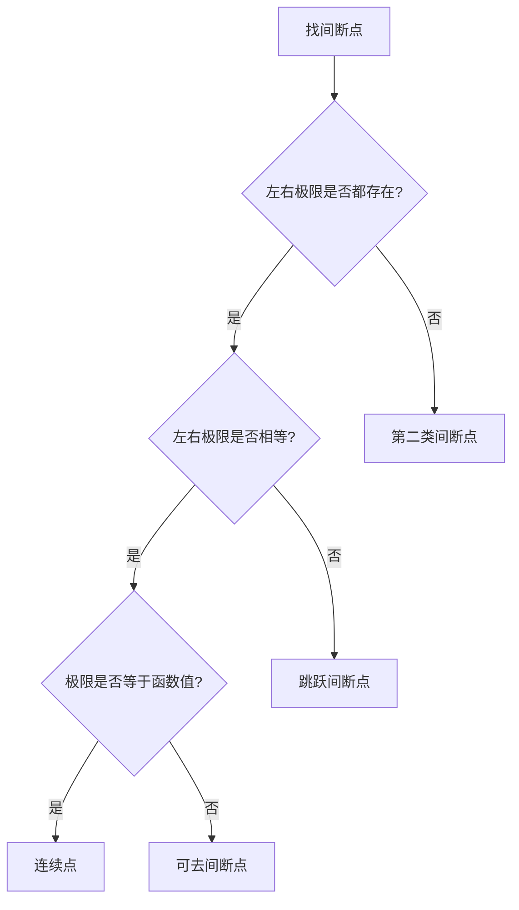

# 连续性理论综合专题 🔗

#数学二 #高等数学 #连续性 #函数极限连续 #综合专题 #考研必备

> 连续性是函数的重要性质，是极限理论的重要应用。本专题全面梳理连续性的概念、判定、性质和应用。

## 目录导航 📑

[TOC]

---

## 第一章：连续性的概念与本质 🏗️

### 1.1 连续性的直观理解

#### 1.1.1 几何直观

函数在某点连续意味着：
- **图像不断开**：可以一笔画出
- **无跳跃**：函数值平滑过渡
- **可预测**：小的输入变化导致小的输出变化

#### 1.1.2 物理意义

1. **运动的连续性**：物体位置随时间连续变化
2. **温度的连续性**：温度不会瞬间跳变
3. **经济的连续性**：价格通常连续变化

### 1.2 连续性的严格定义

#### 1.2.1 在一点的连续性

**定义**：函数 $f(x)$ 在点 $x_0$ 连续的充要条件是：
$$\lim_{x \to x_0} f(x) = f(x_0)$$

**三要素**：
1. $f(x_0)$ 有定义
2. $\lim_{x \to x_0} f(x)$ 存在
3. 极限值等于函数值

#### 1.2.2 ε-δ 语言

$f(x)$ 在 $x_0$ 连续 $\Leftrightarrow$ 对任意 $\varepsilon > 0$，存在 $\delta > 0$，使得当 $|x - x_0| < \delta$ 时，有 $|f(x) - f(x_0)| < \varepsilon$

#### 1.2.3 左连续与右连续

- **左连续**：$\lim_{x \to x_0^-} f(x) = f(x_0)$
- **右连续**：$\lim_{x \to x_0^+} f(x) = f(x_0)$
- **连续的充要条件**：既左连续又右连续

### 1.3 连续性的等价描述

#### 1.3.1 增量形式

$f(x)$ 在 $x_0$ 连续 $\Leftrightarrow$ $\lim_{\Delta x \to 0} \Delta y = 0$

其中 $\Delta y = f(x_0 + \Delta x) - f(x_0)$

#### 1.3.2 复合函数形式

若 $\lim_{x \to x_0} g(x) = g(x_0)$，$f$ 在 $g(x_0)$ 连续，则：
$$\lim_{x \to x_0} f(g(x)) = f(g(x_0)) = f(\lim_{x \to x_0} g(x))$$

即：连续函数可以与极限号交换次序。

---

## 第二章：间断点的分类与研究 🔍

### 2.1 间断点的定义

**间断点**：使函数不连续的点

**产生原因**：
1. 函数在该点无定义
2. 极限不存在
3. 极限存在但不等于函数值

### 2.2 间断点的分类体系

```
间断点
├── 第一类间断点（左右极限都存在）
│   ├── 可去间断点（左极限 = 右极限 ≠ 函数值）
│   └── 跳跃间断点（左极限 ≠ 右极限）
└── 第二类间断点（至少一侧极限不存在）
    ├── 无穷间断点（极限为无穷）
    └── 震荡间断点（极限震荡不存在）
```

### 2.3 各类间断点详解

#### 2.3.1 可去间断点

**特征**：$\lim_{x \to x_0} f(x)$ 存在，但 $\neq f(x_0)$ 或 $f(x_0)$ 无定义

**例子**：
$$f(x) = \frac{\sin x}{x}, \quad x_0 = 0$$
- $\lim_{x \to 0} \frac{\sin x}{x} = 1$
- $f(0)$ 无定义
- 补充定义 $f(0) = 1$ 可使函数连续

#### 2.3.2 跳跃间断点

**特征**：左右极限都存在但不相等

**例子**：
$$f(x) = \begin{cases}
x + 1, & x < 0 \\
x - 1, & x \geq 0
\end{cases}$$
- $f(0^-) = 1$，$f(0^+) = -1$
- 跳跃量：$|f(0^+) - f(0^-)| = 2$

#### 2.3.3 无穷间断点

**特征**：至少一侧极限为无穷

**例子**：
$$f(x) = \frac{1}{x}, \quad x_0 = 0$$
- $\lim_{x \to 0^+} f(x) = +\infty$
- $\lim_{x \to 0^-} f(x) = -\infty$

#### 2.3.4 震荡间断点

**特征**：函数值在某点附近无限震荡

**例子**：
$$f(x) = \sin \frac{1}{x}, \quad x_0 = 0$$
- 当 $x \to 0$ 时，$\frac{1}{x} \to \infty$
- $\sin \frac{1}{x}$ 在 $[-1, 1]$ 间无限震荡

### 2.4 间断点的判定步骤

1. **找出可疑点**：
   - 分母为零的点
   - 分段函数的分界点
   - 定义域的边界点

2. **计算左右极限**：
   - 若都存在且相等 → 可能是可去间断点
   - 若都存在但不等 → 跳跃间断点
   - 若至少一个不存在 → 第二类间断点

3. **与函数值比较**：
   - 极限 = 函数值 → 连续点
   - 极限 ≠ 函数值 → 可去间断点

---

## 第三章：连续函数的性质 🌟

### 3.1 局部性质

#### 3.1.1 局部有界性

若 $f(x)$ 在 $x_0$ 连续，则存在 $\delta > 0$，使得 $f(x)$ 在 $(x_0 - \delta, x_0 + \delta)$ 内有界。

#### 3.1.2 局部保号性

若 $f(x)$ 在 $x_0$ 连续且 $f(x_0) > 0$（或 $< 0$），则存在 $\delta > 0$，使得在 $(x_0 - \delta, x_0 + \delta)$ 内 $f(x) > 0$（或 $< 0$）。

#### 3.1.3 四则运算保持连续性

若 $f(x)$、$g(x)$ 在 $x_0$ 连续，则：
- $f(x) \pm g(x)$ 在 $x_0$ 连续
- $f(x) \cdot g(x)$ 在 $x_0$ 连续
- $\frac{f(x)}{g(x)}$ 在 $x_0$ 连续（若 $g(x_0) \neq 0$）

### 3.2 闭区间上连续函数的性质

#### 3.2.1 有界性定理

**定理**：闭区间上的连续函数必有界。

**推论**：连续函数在闭区间上必有最大值和最小值。

#### 3.2.2 最值定理

**定理**：若 $f(x)$ 在 $[a, b]$ 上连续，则存在 $x_1, x_2 \in [a, b]$，使得：
$$f(x_1) = \min_{x \in [a,b]} f(x), \quad f(x_2) = \max_{x \in [a,b]} f(x)$$

#### 3.2.3 介值定理

**定理**：若 $f(x)$ 在 $[a, b]$ 上连续，且 $f(a) \neq f(b)$，则对任意介于 $f(a)$ 和 $f(b)$ 之间的数 $C$，至少存在一点 $\xi \in (a, b)$，使得 $f(\xi) = C$。

**零点定理**（特例）：若 $f(a) \cdot f(b) < 0$，则至少存在一点 $\xi \in (a, b)$，使得 $f(\xi) = 0$。

#### 3.2.4 一致连续性

**定义**：$f(x)$ 在区间 $I$ 上一致连续 $\Leftrightarrow$ 对任意 $\varepsilon > 0$，存在 $\delta > 0$，对任意 $x_1, x_2 \in I$，当 $|x_1 - x_2| < \delta$ 时，有 $|f(x_1) - f(x_2)| < \varepsilon$。

**康托定理**：闭区间上的连续函数必一致连续。

### 3.3 连续函数的复合

#### 3.3.1 复合函数的连续性

若 $u = g(x)$ 在 $x_0$ 连续，$y = f(u)$ 在 $u_0 = g(x_0)$ 连续，则复合函数 $y = f(g(x))$ 在 $x_0$ 连续。

#### 3.3.2 反函数的连续性

若 $f(x)$ 在 $[a, b]$ 上连续且严格单调，则其反函数 $f^{-1}(y)$ 在 $[f(a), f(b)]$（或 $[f(b), f(a)]$）上连续且严格单调。

---

## 第四章：初等函数的连续性 📐

### 4.1 基本初等函数的连续性

**定理**：所有基本初等函数在其定义域内都是连续的。

#### 4.1.1 幂函数

$f(x) = x^a$ 在其定义域内连续：
- $a > 0$：在 $[0, +\infty)$ 连续
- $a < 0$：在 $(0, +\infty)$ 连续
- $a$ 为整数：在 $\mathbb{R}$ 连续

#### 4.1.2 指数函数

$f(x) = a^x$ （$a > 0, a \neq 1$）在 $\mathbb{R}$ 上连续

#### 4.1.3 对数函数

$f(x) = \log_a x$ （$a > 0, a \neq 1$）在 $(0, +\infty)$ 上连续

#### 4.1.4 三角函数

- $\sin x$、$\cos x$ 在 $\mathbb{R}$ 上连续
- $\tan x$ 在 $x \neq \frac{\pi}{2} + k\pi$ 处连续
- $\cot x$ 在 $x \neq k\pi$ 处连续

#### 4.1.5 反三角函数

- $\arcsin x$、$\arccos x$ 在 $[-1, 1]$ 上连续
- $\arctan x$、$\text{arccot } x$ 在 $\mathbb{R}$ 上连续

### 4.2 初等函数的连续性

**定理**：由基本初等函数经过有限次四则运算和复合得到的函数，在其定义域内连续。

**应用**：判断函数连续性时，只需确定其定义域。

### 4.3 分段函数的连续性

#### 4.3.1 判定方法

在分段点 $x_0$ 处：
1. 计算左极限：$\lim_{x \to x_0^-} f(x)$
2. 计算右极限：$\lim_{x \to x_0^+} f(x)$
3. 计算函数值：$f(x_0)$
4. 三者相等则连续

#### 4.3.2 典型例题

**例**：讨论函数的连续性
$$f(x) = \begin{cases}
\frac{\sin x}{x}, & x \neq 0 \\
1, & x = 0
\end{cases}$$

**解**：
- $x \neq 0$ 时，$f(x) = \frac{\sin x}{x}$ 连续
- $x = 0$ 时：
  - $\lim_{x \to 0} \frac{\sin x}{x} = 1 = f(0)$
  - 所以在 $x = 0$ 处连续
- 结论：$f(x)$ 在 $\mathbb{R}$ 上连续

---

## 第五章：连续性的应用 💡

### 5.1 方程根的存在性

#### 5.1.1 零点定理的应用

**基本步骤**：
1. 构造连续函数 $f(x)$
2. 找到 $a, b$ 使 $f(a) \cdot f(b) < 0$
3. 由零点定理，至少存在一个根

**例题**：证明方程 $x^3 + x - 1 = 0$ 在 $(0, 1)$ 内有根

**证明**：
- 令 $f(x) = x^3 + x - 1$
- $f(0) = -1 < 0$，$f(1) = 1 > 0$
- $f(x)$ 在 $[0, 1]$ 连续
- 由零点定理，至少存在 $\xi \in (0, 1)$ 使 $f(\xi) = 0$

#### 5.1.2 不动点定理

**定理**：若 $f(x)$ 在 $[a, b]$ 上连续，且 $f([a, b]) \subset [a, b]$，则至少存在一点 $\xi \in [a, b]$，使得 $f(\xi) = \xi$。

**证明思路**：构造 $g(x) = f(x) - x$，用零点定理。

### 5.2 函数的一致连续性

#### 5.2.1 一致连续的判定

1. **闭区间**：连续 $\Rightarrow$ 一致连续（康托定理）
2. **开区间**：需要具体分析

**判定方法**：
- 利用导数有界：若 $|f'(x)| \leq M$，则一致连续
- 利用极限：若 $\lim_{x \to a^+} f(x)$ 和 $\lim_{x \to b^-} f(x)$ 都存在，则一致连续

#### 5.2.2 非一致连续的例子

**例1**：$f(x) = \frac{1}{x}$ 在 $(0, 1)$ 上不一致连续

**证明**：取 $x_n = \frac{1}{n}$，$y_n = \frac{1}{n+1}$
- $|x_n - y_n| = \frac{1}{n(n+1)} \to 0$
- $|f(x_n) - f(y_n)| = |n - (n+1)| = 1$
- 不满足一致连续的定义

**例2**：$f(x) = x^2$ 在 $\mathbb{R}$ 上不一致连续

### 5.3 连续延拓

#### 5.3.1 概念

将函数的定义域扩大，使其在更大的范围内连续。

#### 5.3.2 方法

对可去间断点，补充定义使其连续。

**例**：$f(x) = \frac{x^2 - 1}{x - 1}$ 在 $x = 1$ 处可去间断
- 化简：$f(x) = x + 1$ （$x \neq 1$）
- 补充定义：$f(1) = 2$
- 得到连续延拓

### 5.4 最值问题

#### 5.4.1 闭区间上的最值

**步骤**：
1. 求导，找驻点
2. 计算驻点处的函数值
3. 计算端点处的函数值
4. 比较得出最值

#### 5.4.2 开区间上的最值

需要考虑：
- 驻点处的值
- 端点处的极限
- 函数的单调性

---

## 第六章：特殊类型函数的连续性 🎯

### 6.1 复合函数的连续性

#### 6.1.1 连续性的传递

若 $g(x)$ 在 $x_0$ 连续，$f(u)$ 在 $u_0 = g(x_0)$ 连续，则 $f(g(x))$ 在 $x_0$ 连续。

#### 6.1.2 极限与函数符号交换

若 $f(x)$ 连续，则：
$$\lim_{x \to x_0} f(g(x)) = f(\lim_{x \to x_0} g(x))$$

**应用**：计算复杂极限

### 6.2 含参数函数的连续性

#### 6.2.1 参数确定

利用连续性条件确定参数值。

**例**：$f(x) = \begin{cases} x^2 + a, & x < 1 \\ bx + 2, & x \geq 1 \end{cases}$ 在 $x = 1$ 连续，求 $a, b$

**解**：
- 左极限：$\lim_{x \to 1^-} (x^2 + a) = 1 + a$
- 右极限：$\lim_{x \to 1^+} (bx + 2) = b + 2$
- 函数值：$f(1) = b + 2$
- 连续条件：$1 + a = b + 2$

#### 6.2.2 参数范围

确定使函数连续的参数范围。

### 6.3 隐函数的连续性

由方程 $F(x, y) = 0$ 确定的隐函数 $y = y(x)$，在满足隐函数存在定理条件下连续。

### 6.4 周期函数的连续性

若 $f(x)$ 是周期为 $T$ 的函数，且在一个周期内连续，则在整个定义域内连续。

---

## 第七章：连续性与其他概念的关系 🔗

### 7.1 连续与可导

#### 7.1.1 关系图

```
可导 ⟹ 连续
连续 ⇏ 可导
```

#### 7.1.2 反例

**连续但不可导**：
1. $f(x) = |x|$ 在 $x = 0$
2. $f(x) = \sqrt[3]{x}$ 在 $x = 0$
3. $f(x) = x^{2/3}$ 在 $x = 0$

### 7.2 连续与可积

#### 7.2.1 基本关系

- 闭区间上连续 ⟹ 可积
- 有界且只有有限个间断点 ⟹ 可积

#### 7.2.2 可积性判定

连续性是可积的充分条件，但不是必要条件。

### 7.3 连续与单调

#### 7.3.1 单调连续函数

闭区间上的单调连续函数存在连续的反函数。

#### 7.3.2 应用

利用单调性和连续性证明方程根的唯一性。

---

## 第八章：连续性问题的解题技巧 💪

### 8.1 判断连续性的技巧

#### 8.1.1 初等函数法

确认是否为初等函数，检查定义域。

#### 8.1.2 极限法

计算 $\lim_{x \to x_0} f(x)$ 是否等于 $f(x_0)$。

#### 8.1.3 左右极限法

对分段函数和含绝对值的函数特别有效。

### 8.2 间断点分类的技巧

#### 8.2.1 快速判断

1. 分母为零 → 可能是无穷间断点
2. 分段点 → 需要算左右极限
3. 震荡函数 → 可能是震荡间断点

#### 8.2.2 系统方法



### 8.3 证明题技巧

#### 8.3.1 存在性证明

1. 零点定理：证明方程有根
2. 介值定理：证明函数值的存在
3. 最值定理：证明最值的存在

#### 8.3.2 构造函数

根据要证明的结论，巧妙构造辅助函数。

---

## 第九章：典型例题与易错点 ⚠️

### 9.1 典型例题

#### 例题1：综合判断

判断函数的连续性和间断点类型：
$$f(x) = \frac{x \sin \frac{1}{x}}{|x|}$$

**解答**：
- $x > 0$：$f(x) = \sin \frac{1}{x}$，连续
- $x < 0$：$f(x) = -\sin \frac{1}{x}$，连续
- $x = 0$：无定义，需要算极限
  - $\lim_{x \to 0^+} f(x)$ 不存在（震荡）
  - $\lim_{x \to 0^-} f(x)$ 不存在（震荡）
- 结论：$x = 0$ 是第二类震荡间断点

#### 例题2：参数问题

设 $f(x) = \begin{cases} \frac{e^{ax} - 1}{x}, & x \neq 0 \\ b, & x = 0 \end{cases}$ 在 $\mathbb{R}$ 上连续，求 $a, b$。

**解答**：
$$\lim_{x \to 0} \frac{e^{ax} - 1}{x} = \lim_{x \to 0} \frac{ax}{x} = a$$
连续条件：$a = b$

#### 例题3：证明题

证明：若 $f(x)$ 在 $[a, b]$ 上连续，$f(a) < 0 < f(b)$，且 $f(x) = 0$ 只有一个根，则这个根将 $[a, b]$ 分成两部分，使得 $f(x)$ 在一部分恒负，在另一部分恒正。

**证明**：[详细证明过程]

### 9.2 易错点总结

1. **混淆间断点类型**
   - 记住：第一类看左右极限是否相等
   - 第二类看左右极限是否都存在

2. **忽视定义域**
   - 先确定函数的定义域
   - 在定义域内才谈连续性

3. **分段函数的处理**
   - 分段点必须单独检查
   - 不要忘记计算函数值

4. **极限存在与连续的区别**
   - 极限存在不一定连续
   - 连续要求极限值等于函数值

---

## 第十章：连续性理论的深化与拓展 🌟

### 10.1 度量空间中的连续性

#### 10.1.1 定义推广

在度量空间 $(X, d_X)$ 和 $(Y, d_Y)$ 中，$f: X \to Y$ 在 $x_0$ 连续：
$$\forall \varepsilon > 0, \exists \delta > 0, \forall x \in X: d_X(x, x_0) < \delta \Rightarrow d_Y(f(x), f(x_0)) < \varepsilon$$

#### 10.1.2 拓扑连续性

开集的原像是开集。

### 10.2 利普希茨连续

#### 10.2.1 定义

存在常数 $L > 0$，使得对所有 $x_1, x_2$：
$$|f(x_1) - f(x_2)| \leq L|x_1 - x_2|$$

#### 10.2.2 性质

利普希茨连续 ⟹ 一致连续 ⟹ 连续

### 10.3 赫尔德连续

#### 10.3.1 定义

存在常数 $C > 0$ 和 $0 < \alpha \leq 1$，使得：
$$|f(x_1) - f(x_2)| \leq C|x_1 - x_2|^\alpha$$

#### 10.3.2 关系

- $\alpha = 1$：利普希茨连续
- $0 < \alpha < 1$：赫尔德连续

### 10.4 绝对连续

与勒贝格积分理论相关的更强的连续性概念。

---

## 结语 🎊

连续性是分析学的基础概念，其重要性体现在：

1. **理论基础**：微积分基本定理的前提
2. **实际应用**：描述现实世界的连续变化
3. **数学美学**：体现了数学的和谐与统一

**学习建议**：
1. 深刻理解定义，不要死记硬背
2. 多做例题，熟悉各种类型
3. 注意与其他概念的联系
4. 培养几何直观

> 💡 **名言**："连续性是自然界的语言。" —— 莱布尼茨

愿你在连续性的学习中，体会到数学的连贯之美！🌈