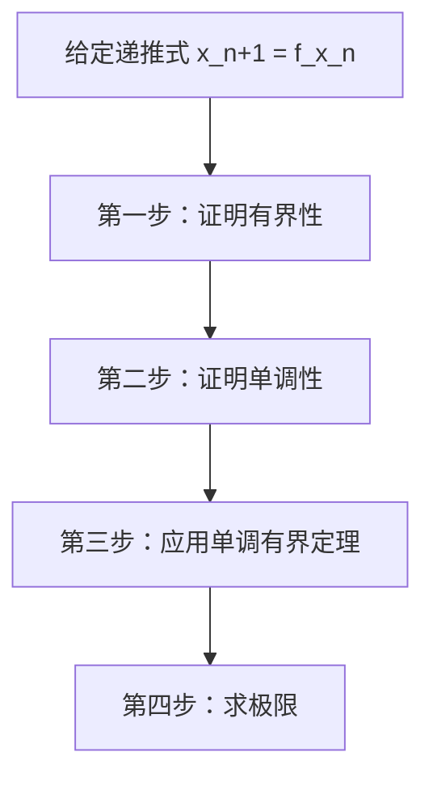

# 递推数列收敛性证明·通用方法

## 📚 知识点概述

递推数列收敛性证明是考研数学的**高频考点**，通常以证明题形式出现。核心是应用**单调有界定理**。

## 🎯 标准解题流程（四步法）



### 第一步：证明有界性

**常用方法**：

#### 方法1：数学归纳法
```
① 验证 n=1 时成立：a ≤ x₁ ≤ b
② 假设 n=k 时成立：a ≤ xₖ ≤ b
③ 证明 n=k+1 时也成立：a ≤ xₖ₊₁ ≤ b
```

#### 方法2：利用不等式
- **均值不等式**：$\frac{x+y}{2} \geq \sqrt{xy}$
- **柯西不等式**
- **函数性质**（单调性、值域）

#### 方法3：反证法
假设无界，推出矛盾

**示例**：
- $x_{n+1} = \frac{1}{2}(x_n + \frac{a}{x_n})$
- 由均值不等式：$x_{n+1} \geq \sqrt{a}$（下界）

---

### 第二步：证明单调性

**常用方法**：

#### 方法1：作差法
计算 $x_{n+1} - x_n$ 的符号

$$x_{n+1} - x_n \begin{cases}
> 0 & \text{递增} \\
< 0 & \text{递减} \\
= 0 & \text{常数列}
\end{cases}$$

**技巧**：
- 通分化简
- 因式分解
- 利用已证明的界

#### 方法2：作商法
计算 $\frac{x_{n+1}}{x_n}$ 与 1 的大小关系

$$\frac{x_{n+1}}{x_n} \begin{cases}
> 1 & \text{递增} \\
< 1 & \text{递减}
\end{cases}$$

适用于：正项数列，递推式为乘积形式

#### 方法3：函数性质法
若 $x_{n+1} = f(x_n)$，研究 $y = f(x)$ 的单调性

- $f'(x) > 0$ → $f$ 递增 → 若 $x_1 < x_2$，则 $f(x_1) < f(x_2)$
- 结合不动点分析

**示例**：
$$x_{n+1} - x_n = \frac{a - x_n^2}{2x_n}$$

当 $x_n > \sqrt{a}$ 时，分子 $< 0$，所以递减

---

### 第三步：应用单调有界定理

**定理内容**：
- 单调递增 + 有上界 → 收敛
- 单调递减 + 有下界 → 收敛

**标准表述**：
"由前两步知，数列 $\{x_n\}$ 单调递减（或递增）且有下界（或上界），根据单调有界定理，数列收敛。"

---

### 第四步：求极限

**标准步骤**：

1. **设极限**：设 $\lim_{n\to\infty} x_n = L$

2. **利用性质**：$\lim_{n\to\infty} x_{n+1} = L$

3. **取极限**：对递推式 $x_{n+1} = f(x_n)$ 两边取极限：
   $$L = f(L)$$

4. **解方程**：求出 $L$ 的值

5. **验证**：检验 $L$ 是否符合条件（正负、范围等）

**示例**：
$$L = \frac{1}{2}\left(L + \frac{a}{L}\right) \Rightarrow L^2 = a \Rightarrow L = \sqrt{a}$$

---

## 📖 常见递推类型

### 类型1：线性递推
**形式**：$x_{n+1} = ax_n + b$

**特点**：
- 容易证明单调性（作差法）
- 不动点：$L = aL + b \Rightarrow L = \frac{b}{1-a}$

**示例**：$x_{n+1} = \frac{1}{2}x_n + 1$

---

### 类型2：分式递推
**形式**：$x_{n+1} = \frac{ax_n + b}{cx_n + d}$

**特点**：
- 通分后作差
- 利用函数性质

**示例**：$x_{n+1} = \frac{x_n + c}{x_n + 1}$

---

### 类型3：根式递推
**形式**：$x_{n+1} = \sqrt{a + x_n}$ 或 $\sqrt{a x_n}$

**特点**：
- 平方后分析
- 数学归纳法证有界

**示例**：$x_{n+1} = \sqrt{2 + x_n}$

---

### 类型4：均值型递推
**形式**：$x_{n+1} = \frac{1}{2}\left(x_n + \frac{a}{x_n}\right)$

**特点**：
- 均值不等式证有界
- 牛顿迭代法背景

**示例**：本题

---

## 🔧 技巧总结

### 技巧1：先猜后证
1. 先用前几项猜测极限值
2. 用猜测的值帮助证明有界性

**示例**：猜测 $L = \sqrt{a}$，然后证明 $x_n \geq \sqrt{a}$

---

### 技巧2：利用不动点
不动点 $L$ 满足 $L = f(L)$

- 与不动点比较确定单调性
- $x_n > L$ 时，分析 $x_{n+1}$ 与 $L$ 的关系

---

### 技巧3：变量替换
有时引入新变量可简化问题

**示例**：令 $y_n = x_n - L$，研究 $y_n$ 的性质

---

### 技巧4：分段讨论
根据初值 $x_1$ 的不同情况分段分析

**示例**：
- $x_1 > \sqrt{a}$ 时，从 $n=1$ 开始递减
- $x_1 < \sqrt{a}$ 时，先增后减

---

## ⚠️ 常见错误

### 错误1：只证单调或只证有界
**正确**：必须**同时证明**单调性和有界性

### 错误2：忘记讨论初值的影响
**正确**：需要根据 $x_1$ 的不同情况分类讨论

### 错误3：求极限时忘记验证
**正确**：方程可能有多个解，需要根据数列性质筛选

### 错误4：单调性方向判断错误
**正确**：仔细分析差值的符号，必要时举例验证

---

## 📝 模板总结

### 证明递推数列收敛的标准模板

```
证明：

（一）证明有界性

[使用数学归纳法/不等式/函数性质]

证明：存在常数 M，使得对所有 n，都有 |x_n| ≤ M（或 a ≤ x_n ≤ b）

（二）证明单调性

[使用作差法/作商法/函数性质法]

计算 x_{n+1} - x_n = ...

分析符号，得出：
- x_{n+1} > x_n（递增）或
- x_{n+1} < x_n（递减）

（三）应用单调有界定理

由（一）（二）知，数列 {x_n} 单调[递增/递减]且有[上界/下界]，
根据单调有界定理，数列 {x_n} 收敛。

（四）求极限

设 lim(n→∞) x_n = L

对递推式两边取极限：
L = f(L)

解方程得：L = ...

因为 [验证条件]，所以 lim(n→∞) x_n = ...

证毕。
```

---

## 🎓 进阶内容

### 不满足单调性时怎么办？

#### 方法1：考察子列
- 研究奇数项 $\{x_{2n-1}\}$ 和偶数项 $\{x_{2n}\}$
- 分别证明单调有界
- 证明两个子列极限相同

#### 方法2：柯西收敛准则
证明：对任意 $\varepsilon > 0$，存在 $N$，当 $m, n > N$ 时，$|x_m - x_n| < \varepsilon$

---

### 递推数列的其他性质

#### 1. 周期性
若存在 $p$，使得 $x_{n+p} = x_n$，则数列周期

#### 2. 振荡性
$x_n$ 在某值附近上下波动

#### 3. 发散性
证明数列无界或振荡不收敛

---

## 🔗 相关定理

### 1. 单调有界定理（重要！）
单调递增有上界（或单调递减有下界）的数列必收敛

### 2. 夹逼定理
若 $a_n \leq b_n \leq c_n$ 且 $\lim a_n = \lim c_n = L$，则 $\lim b_n = L$

### 3. 柯西收敛准则
数列收敛 ⟺ 对任意 $\varepsilon > 0$，存在 $N$，当 $m,n > N$ 时，$|x_m - x_n| < \varepsilon$

---

## 📚 推荐练习题

### 基础题
1. $x_1 = 1, x_{n+1} = \frac{1}{2}(x_n + 2)$
2. $x_1 = 0, x_{n+1} = \sqrt{2 + x_n}$
3. $x_1 = 2, x_{n+1} = 2 - \frac{1}{x_n}$

### 进阶题
4. $x_1 = 1, x_{n+1} = x_n + \frac{1}{x_n}$（发散）
5. $x_1 = a, x_{n+1} = \sin x_n$
6. $x_1 = 1, x_{n+1} = \frac{x_n^2 + 2}{2x_n}$

---

## 💪 备考建议

### 重点掌握：
1. ✅ 单调有界定理的应用
2. ✅ 作差法证明单调性
3. ✅ 均值不等式证明有界性
4. ✅ 求极限的标准步骤

### 训练目标：
1. 看到递推式能立即判断收敛性
2. 熟练写出完整证明过程
3. 准确计算极限值

### 时间分配：
- 证明收敛：5-8分钟
- 求极限：2-3分钟
- 总计：约10分钟（大题）

---

## 📖 相关笔记
- [[单调有界定理详解]]
- [[数列极限定义与性质]]
- [[常用不等式总结]]
- [[牛顿迭代法原理]]
- [[GS_001_递推数列收敛性_20251005]]（对应错题）

---

**最后提醒**：这类题目**模板化**很强，多练几道就能掌握！关键是**步骤完整**，**逻辑清晰**，不要遗漏任何一个条件的证明。💪