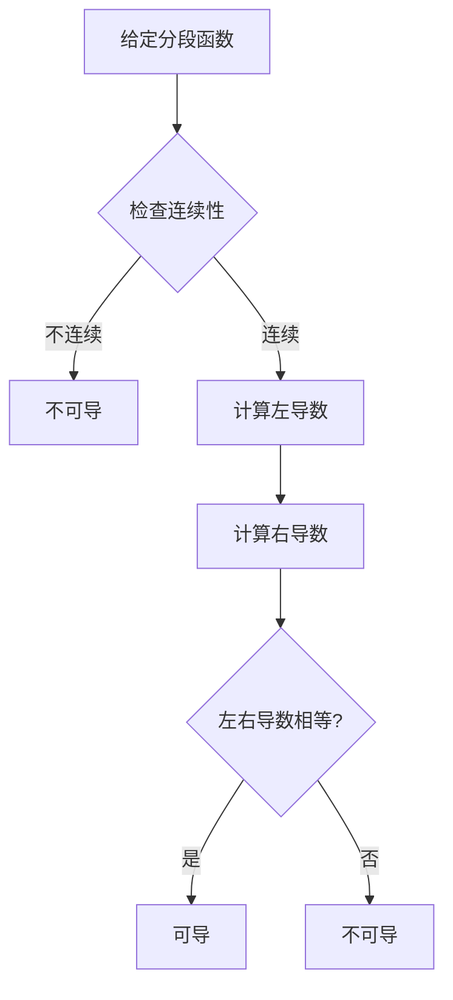

# 单侧导数

#数学二 #高等数学 #第二章 #知识点/导数 #知识点/单侧导数 #知识点/可导性

## 🏷️ 标签体系
- **L1知识点**：`单侧导数` `左导数` `右导数` `导数存在条件`
- **L2方法**：`极限计算法` `分段函数求导法`
- **L3章节**：`一元函数微分学`
- **难度**：`medium`

## 📖 单侧导数的定义（原书第56-57页）

### 🤔 为什么要学单侧导数？
在学习导数时，我们遇到一个问题：有些函数在某些点处"不光滑"，比如绝对值函数 $|x|$ 在 $x=0$ 处有个"尖角"。这时候，从左边逼近和从右边逼近会得到不同的结果。单侧导数就是用来精确描述这种情况的工具。

### 一、左导数的定义

#### 💭 直观理解
左导数就是"从左边看"函数在某点的变化率。想象你站在 $x_0$ 点的左边，慢慢向 $x_0$ 走近，观察函数的斜率。

#### 📐 数学定义
设函数 $y = f(x)$ 在点 $x_0$ 及其某个左邻域内有定义，若左极限

$$f'_{-}(x_0) = \lim_{\Delta x \to 0^-} \frac{f(x_0 + \Delta x) - f(x_0)}{\Delta x}$$

存在，则称该极限值为 $f(x)$ 在点 $x_0$ 处的左导数，记为 $f'_{-}(x_0)$。

#### 🔄 三种等价形式（都很常用！）
1. **增量形式**：$f'_{-}(x_0) = \lim_{\Delta x \to 0^-} \frac{f(x_0 + \Delta x) - f(x_0)}{\Delta x}$
2. **h形式**：$f'_{-}(x_0) = \lim_{h \to 0^-} \frac{f(x_0 + h) - f(x_0)}{h}$（$h<0$）
3. **x形式**：$f'_{-}(x_0) = \lim_{x \to x_0^-} \frac{f(x) - f(x_0)}{x - x_0}$（$x<x_0$）

### 二、右导数的定义

#### 💭 直观理解
右导数就是"从右边看"函数在某点的变化率。这次你站在 $x_0$ 点的右边，慢慢向 $x_0$ 走近。

#### 📐 数学定义
设函数 $y = f(x)$ 在点 $x_0$ 及其某个右邻域内有定义，若右极限

$$f'_{+}(x_0) = \lim_{\Delta x \to 0^+} \frac{f(x_0 + \Delta x) - f(x_0)}{\Delta x}$$

存在，则称该极限值为 $f(x)$ 在点 $x_0$ 处的右导数，记为 $f'_{+}(x_0)$。

#### 🔄 三种等价形式
1. **增量形式**：$f'_{+}(x_0) = \lim_{\Delta x \to 0^+} \frac{f(x_0 + \Delta x) - f(x_0)}{\Delta x}$
2. **h形式**：$f'_{+}(x_0) = \lim_{h \to 0^+} \frac{f(x_0 + h) - f(x_0)}{h}$（$h>0$）
3. **x形式**：$f'_{+}(x_0) = \lim_{x \to x_0^+} \frac{f(x) - f(x_0)}{x - x_0}$（$x>x_0$）

## 🔑 导数存在的充要条件

### 📌 核心定理
函数 $f(x)$ 在点 $x_0$ 处可导 **当且仅当**：
1. 左导数 $f'_{-}(x_0)$ 存在
2. 右导数 $f'_{+}(x_0)$ 存在
3. 二者相等：$f'_{-}(x_0) = f'_{+}(x_0)$

此时，$f'(x_0) = f'_{-}(x_0) = f'_{+}(x_0)$

### ⚠️ 重要提醒
- 左右导数都存在 **但不相等** → 函数在该点不可导（有"尖角"）
- 左右导数至少有一个不存在 → 函数在该点不可导

## 📐 典型例题详解

### 例1：绝对值函数的单侧导数【最经典的例子】

考虑 $f(x) = |x|$ 在 $x = 0$ 处的可导性。

#### 🎯 学生思路引导
1. **第一步：画图理解**
   - $|x|$ 的图像是个"V"字形
   - 在 $x=0$ 处有个尖角
   - 直观感觉：左边斜率是-1，右边斜率是1

2. **第二步：写出分段形式**
   $$f(x) = |x| = \begin{cases}
   -x, & x < 0\\
   0, & x = 0\\
   x, & x > 0
   \end{cases}$$

3. **第三步：计算左导数**
   ```
   当 x<0 时，f(x) = -x
   所以从左边看：
   f'_{-}(0) = lim[x→0⁻] (f(x) - f(0))/(x - 0)
            = lim[x→0⁻] (-x - 0)/x
            = lim[x→0⁻] (-x)/x
            = -1
   ```

4. **第四步：计算右导数**
   ```
   当 x>0 时，f(x) = x
   所以从右边看：
   f'_{+}(0) = lim[x→0⁺] (f(x) - f(0))/(x - 0)
            = lim[x→0⁺] (x - 0)/x
            = lim[x→0⁺] x/x
            = 1
   ```

5. **第五步：下结论**
   - $f'_{-}(0) = -1$
   - $f'_{+}(0) = 1$
   - 因为 $-1 \neq 1$，所以 $f(x) = |x|$ 在 $x = 0$ 处不可导

#### 💡 深入理解
- **几何意义**：在 $x=0$ 处，左切线斜率是-1，右切线斜率是1，两条切线不重合
- **物理意义**：如果这是位移-时间图，在 $t=0$ 时刻速度发生了突变

### 例2：分段函数的可导性判断【考试重点】

设 $f(x) = \begin{cases}
x^2, & x \leq 1\\
ax + b, & x > 1
\end{cases}$

问：$a$、$b$ 取何值时，$f(x)$ 在 $x = 1$ 处可导？

#### 🎯 学生思路引导

##### 第0步：理解题意
- 这是个分段函数，在 $x=1$ 处"拼接"
- 我们要让这个拼接处"光滑"（可导）

##### 第1步：先保证连续（可导的必要条件）
```
💭 思考：不连续肯定不可导，所以先让函数连续

左极限：lim[x→1⁻] f(x) = lim[x→1⁻] x² = 1
右极限：lim[x→1⁺] f(x) = lim[x→1⁺] (ax + b) = a + b
函数值：f(1) = 1²= 1（因为1≤1，用第一段）

连续条件：左极限 = 右极限 = 函数值
所以：a + b = 1 ... ①
```

##### 第2步：计算左导数
```
💭 思考：x<1时，函数是x²，求导得2x

方法一（定义法）：
f'_{-}(1) = lim[x→1⁻] (f(x) - f(1))/(x - 1)
         = lim[x→1⁻] (x² - 1)/(x - 1)
         = lim[x→1⁻] (x - 1)(x + 1)/(x - 1)
         = lim[x→1⁻] (x + 1)
         = 2

方法二（导函数法）：
当x<1时，f(x) = x²，所以f'(x) = 2x
因此 f'_{-}(1) = 2×1 = 2
```

##### 第3步：计算右导数
```
💭 思考：x>1时，函数是ax+b，是条直线

方法一（定义法）：
f'_{+}(1) = lim[x→1⁺] (f(x) - f(1))/(x - 1)
         = lim[x→1⁺] (ax + b - 1)/(x - 1)
         = lim[x→1⁺] (ax + b - (a + b))/(x - 1)  [利用①式]
         = lim[x→1⁺] a(x - 1)/(x - 1)
         = a

方法二（导函数法）：
当x>1时，f(x) = ax + b，所以f'(x) = a
因此 f'_{+}(1) = a
```

##### 第4步：让左右导数相等
```
可导条件：f'_{-}(1) = f'_{+}(1)
即：2 = a
所以：a = 2
```

##### 第5步：求出b
```
由①式：a + b = 1
代入a = 2：2 + b = 1
所以：b = -1
```

##### 答案：$a = 2, b = -1$

#### 🔍 验证答案
当 $a=2, b=-1$ 时：
- $f(x) = \begin{cases} x^2, & x \leq 1\\ 2x-1, & x > 1 \end{cases}$
- 在 $x=1$ 处：$f(1) = 1$，连续 ✓
- 左导数 = 2，右导数 = 2，可导 ✓

### 例3：含振荡因子的函数【易错题】

设 $f(x) = \begin{cases}
x^2\sin\frac{1}{x}, & x \neq 0\\
0, & x = 0
\end{cases}$

讨论在 $x = 0$ 处的可导性。

#### 🎯 学生思路引导

##### 第1步：理解函数特点
```
⚠️ 易错点：sin(1/x) 在x→0时剧烈振荡
但是！前面有x²"压制"它
```

##### 第2步：先检查连续性
```
lim[x→0] f(x) = lim[x→0] x²sin(1/x)

💭 关键技巧：|sin(1/x)| ≤ 1（有界）
所以：|x²sin(1/x)| ≤ |x²| → 0

由夹逼定理：lim[x→0] x²sin(1/x) = 0 = f(0)
所以函数连续 ✓
```

##### 第3步：用定义求导数
```
f'(0) = lim[x→0] (f(x) - f(0))/(x - 0)
      = lim[x→0] (x²sin(1/x) - 0)/x
      = lim[x→0] x·sin(1/x)

同样用夹逼：|x·sin(1/x)| ≤ |x| → 0
所以 f'(0) = 0
```

##### 第4步：理解为什么可导
```
虽然sin(1/x)振荡，但：
- x²让函数值→0（保证连续）
- x让导数值→0（保证可导）
- 振荡被"压制"住了！
```

#### ⚠️ 对比易错例子
如果改成 $g(x) = x\sin\frac{1}{x}$（少了一个x）：
- 仍然连续（x压制振荡）
- 但不可导！（导数定义式变成 $\sin\frac{1}{x}$，振荡不收敛）

## 🎯 方法总结

### 判断分段点可导性的标准流程



### 计算技巧总结
1. **分段函数**：分别用左右两段的表达式
2. **含绝对值**：先化成分段函数
3. **含振荡项**：考虑夹逼定理
4. **含根号**：注意定义域限制

### 常见不可导点类型
1. **尖点型**：$|x|$ 型，左右导数反号
2. **角点型**：分段线性，左右导数不等
3. **垂直切线型**：$\sqrt[3]{x}$ 型，导数为∞
4. **间断点**：不连续必不可导

## 🔗 相关链接
- [[2-1-01 导数的定义]]
- [[2-1-05 连续与可导的关系]]
- [[2-1-03 导数存在的充要条件]]

## 🔗 相关题目练习
根据标签可在题库中搜索：
- 知识点标签：`单侧导数` `左导数` `右导数`
- 章节标签：`一元函数微分学`
- 难度：`medium`