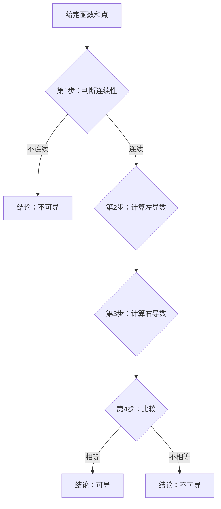

# 连续与可导的关系

#数学二 #高等数学 #第二章 #知识点/连续性 #知识点/可导性 #知识点/可微性

## 🏷️ 标签体系
- **L1知识点**：`连续与可导的关系` `可导与可微的关系` `连续不可导`
- **L2方法**：`关系判断法` `反例构造法`
- **L3章节**：`一元函数微分学`
- **难度**：`hard`

## 🎯 学习目标
学完本节，你应该能够：
1. 清晰理解连续、可导、可微三者的关系
2. 快速判断函数在某点的连续性和可导性
3. 构造满足特定条件的反例
4. 避免常见的概念混淆

## 📖 连续、可导、可微之间的关系（原书第67页）

### 🔑 基本关系定理

#### 一、核心关系图
```
        可微 ←→ 可导
             ↓
           连续
             ↓
         有定义
```

#### 二、关系详解

对于一元函数 $y = f(x)$：

1. **可导必连续**
   - 若 $f(x)$ 在点 $x_0$ 处可导，则 $f(x)$ 在点 $x_0$ 处必连续
   - 逆否命题：不连续必不可导（重要！）

2. **连续不一定可导**
   - $f(x)$ 在点 $x_0$ 处连续，但在点 $x_0$ 处不一定可导
   - 反例：$f(x) = |x|$ 在 $x = 0$ 处

3. **可导与可微等价**（一元函数特有）
   - $f(x)$ 在点 $x_0$ 处可导 ⟺ $f(x)$ 在点 $x_0$ 处可微
   - 注意：多元函数中这两个概念不等价！

### 💡 记忆口诀
"可导必连续，连续未必导；一元导即微，不连必不导。"

## 一、可导必连续的证明【理解为主】

### 🎯 证明思路
要证：可导 ⟹ 连续
即证：$\lim_{x \to x_0} f(x) = f(x_0)$

### 📝 详细证明

设 $f(x)$ 在点 $x_0$ 处可导，即存在：
$$f'(x_0) = \lim_{\Delta x \to 0} \frac{f(x_0 + \Delta x) - f(x_0)}{\Delta x}$$

**关键变形**：
$$f(x_0 + \Delta x) - f(x_0) = \frac{f(x_0 + \Delta x) - f(x_0)}{\Delta x} \cdot \Delta x$$

**取极限**：
$$\lim_{\Delta x \to 0} [f(x_0 + \Delta x) - f(x_0)] = \lim_{\Delta x \to 0} \frac{f(x_0 + \Delta x) - f(x_0)}{\Delta x} \cdot \lim_{\Delta x \to 0} \Delta x$$

$$= f'(x_0) \cdot 0 = 0$$

因此：$\lim_{\Delta x \to 0} f(x_0 + \Delta x) = f(x_0)$

这正是连续的定义！证毕。

### 💭 直观理解
- 可导意味着函数有确定的变化率
- 变化率有限 + 变化量趋于0 = 函数值变化也趋于0
- 这就是连续性

## 二、连续不一定可导的经典反例

### 📐 例1：绝对值函数（最重要）

$f(x) = |x|$ 在 $x = 0$ 处连续但不可导。

#### 🎯 学生思路引导

**Step 1：验证连续性**
```
左极限：lim[x→0⁻] |x| = lim[x→0⁻] (-x) = 0
右极限：lim[x→0⁺] |x| = lim[x→0⁺] x = 0
函数值：f(0) = |0| = 0

因为：左极限 = 右极限 = 函数值 = 0
所以：f(x)在x=0处连续 ✓
```

**Step 2：验证可导性**
```
左导数：f'_{-}(0) = lim[x→0⁻] (|x| - 0)/(x - 0)
                   = lim[x→0⁻] (-x)/x
                   = -1

右导数：f'_{+}(0) = lim[x→0⁺] (|x| - 0)/(x - 0)
                   = lim[x→0⁺] x/x
                   = 1

因为：f'_{-}(0) = -1 ≠ 1 = f'_{+}(0)
所以：f(x)在x=0处不可导 ✗
```

**几何直观**：V字形图像在顶点处有"尖角"

### 📐 例2：立方根函数（垂直切线型）

$f(x) = \sqrt[3]{x^2} = x^{2/3}$ 在 $x = 0$ 处连续但不可导。

#### 🎯 学生思路引导

**Step 1：验证连续性**
```
lim[x→0] x^{2/3} = 0 = f(0)
所以连续 ✓
```

**Step 2：验证可导性**
```
f'(0) = lim[x→0] (x^{2/3} - 0)/(x - 0)
      = lim[x→0] x^{2/3}/x
      = lim[x→0] x^{-1/3}
      = lim[x→0] 1/x^{1/3}
      = ∞（不存在）
```

**几何直观**：在原点处有垂直切线

### 📐 例3：振荡函数（振荡型）

$f(x) = \begin{cases}
x\sin\frac{1}{x}, & x \neq 0\\
0, & x = 0
\end{cases}$ 

在 $x = 0$ 处连续但不可导。

#### 🎯 学生思路引导

**Step 1：验证连续性**
```
|x·sin(1/x)| ≤ |x| → 0（夹逼定理）
所以 lim[x→0] f(x) = 0 = f(0)，连续 ✓
```

**Step 2：验证可导性**
```
f'(0) = lim[x→0] (x·sin(1/x) - 0)/(x - 0)
      = lim[x→0] sin(1/x)

⚠️ 关键：sin(1/x)在x→0时剧烈振荡
极限不存在，所以不可导 ✗
```

## 三、可导与可微的等价性【一元函数特性】

### 📚 定理
对于一元函数，以下三个条件等价：
1. $f(x)$ 在 $x_0$ 处可导
2. $f(x)$ 在 $x_0$ 处可微
3. 存在常数 $A$，使得 $\Delta y = A\Delta x + o(\Delta x)$

且 $A = f'(x_0)$

### 📝 证明：可导 ⟹ 可微

**已知**：$f'(x_0)$ 存在，设 $f'(x_0) = A$

**要证**：$\Delta y = A\Delta x + o(\Delta x)$

**证明过程**：
```
由导数定义：
lim[Δx→0] (Δy - AΔx)/Δx = lim[Δx→0] (Δy/Δx - A)
                        = f'(x₀) - A
                        = 0

这意味着：Δy - AΔx = o(Δx)
即：Δy = AΔx + o(Δx)
```

### 📝 证明：可微 ⟹ 可导

**已知**：$\Delta y = A\Delta x + o(\Delta x)$

**要证**：$f'(x_0) = A$

**证明过程**：
```
Δy/Δx = A + o(Δx)/Δx

取极限：
lim[Δx→0] Δy/Δx = lim[Δx→0] [A + o(Δx)/Δx]
                 = A + 0
                 = A

所以 f'(x₀) = A
```

## 📐 综合例题详解

### 例1：分段函数的连续性与可导性【必考题型】

设 $f(x) = \begin{cases}
x^2, & x \leq 1\\
ax + b, & x > 1
\end{cases}$

问：$a$、$b$ 取何值时，$f(x)$ 在 $x = 1$ 处：
(1) 连续？(2) 可导？

#### 🎯 完整解答过程

**(1) 连续性条件**

```
💭 思路：左极限 = 右极限 = 函数值

左极限：lim[x→1⁻] f(x) = lim[x→1⁻] x² = 1
右极限：lim[x→1⁺] f(x) = lim[x→1⁺] (ax + b) = a + b
函数值：f(1) = 1²= 1（因为1≤1）

连续要求：a + b = 1 ... ①
```

**(2) 可导性条件**

```
💭 思路：先保证连续，再让左导数 = 右导数

左导数：
f'_{-}(1) = lim[x→1⁻] (x² - 1)/(x - 1)
         = lim[x→1⁻] (x - 1)(x + 1)/(x - 1)
         = lim[x→1⁻] (x + 1)
         = 2

右导数：
f'_{+}(1) = lim[x→1⁺] (ax + b - 1)/(x - 1)

利用连续条件①：a + b = 1，所以 ax + b - 1 = ax + b - (a + b) = a(x - 1)

f'_{+}(1) = lim[x→1⁺] a(x - 1)/(x - 1) = a

可导要求：f'_{-}(1) = f'_{+}(1)
即：2 = a

结合①：a = 2, b = -1
```

**答案**：
- 连续：$a + b = 1$（无数组解）
- 可导：$a = 2, b = -1$（唯一解）

### 例2：含振荡项的函数【易错题】

设 $f(x) = \begin{cases}
\sin 2x + x^2\cos\frac{1}{x}, & x \neq 0\\
0, & x = 0
\end{cases}$

判断 $f(x)$ 在 $x = 0$ 处的连续性与可导性。

#### 🎯 学生易错分析

**常见错误**：
1. 忽略 $\sin 2x$ 项
2. 对 $\cos\frac{1}{x}$ 的有界性认识不清
3. 计算导数时展开过于复杂

**正确解法**：

```
Step 1：检查连续性
lim[x→0] f(x) = lim[x→0] [sin 2x + x²cos(1/x)]
              = lim[x→0] sin 2x + lim[x→0] x²cos(1/x)
              = 0 + 0 = 0 = f(0)

💡 关键：
- sin 2x → 0（连续函数）
- |x²cos(1/x)| ≤ |x²| → 0（夹逼）
所以连续 ✓

Step 2：计算导数
f'(0) = lim[x→0] [sin 2x + x²cos(1/x)]/x
      = lim[x→0] sin 2x/x + lim[x→0] x·cos(1/x)
      = lim[x→0] 2·(sin 2x)/(2x) + 0
      = 2·1 + 0
      = 2

所以可导，f'(0) = 2 ✓
```

### 例3：含绝对值的复合函数【提高题】

设 $f(x) = |x - 1|(x^2 - 1)$，讨论 $f(x)$ 在 $x = 1$ 处的可导性。

#### 🎯 深入分析

**Step 1：化简函数**
```
f(x) = |x - 1|·(x² - 1)
     = |x - 1|·(x - 1)(x + 1)
     = (x - 1)·|x - 1|·(x + 1)
```

**Step 2：分段表示**
```
当 x < 1：|x - 1| = -(x - 1)
f(x) = (x - 1)·(-(x - 1))·(x + 1) = -(x - 1)²(x + 1)

当 x > 1：|x - 1| = (x - 1)
f(x) = (x - 1)·(x - 1)·(x + 1) = (x - 1)²(x + 1)

当 x = 1：f(1) = 0
```

**Step 3：计算单侧导数**
```
左导数：
f'_{-}(1) = lim[x→1⁻] [-(x - 1)²(x + 1) - 0]/(x - 1)
         = lim[x→1⁻] -(x - 1)(x + 1)
         = 0

右导数：
f'_{+}(1) = lim[x→1⁺] [(x - 1)²(x + 1) - 0]/(x - 1)
         = lim[x→1⁺] (x - 1)(x + 1)
         = 0

因为 f'_{-}(1) = f'_{+}(1) = 0
所以可导，f'(1) = 0 ✓
```

**💡 关键洞察**：$(x - 1)^2$ 的存在"吸收"了绝对值带来的不可导性！

## 🎯 易错提醒与学习建议

### 一、核心关系记忆表

| 条件 | 结论 | 反例 |
|------|------|------|
| 可导 | 必连续 | 无反例（定理） |
| 连续 | 未必可导 | $\|x\|$ 在 $x=0$ |
| 不连续 | 必不可导 | 无反例（逆否） |
| 可导 | 等价于可微 | 仅对一元函数 |

### 二、常见误区及纠正

#### ❌ 误区1：连续就可导
**正确理解**：连续只是可导的必要条件，不是充分条件
**记忆方法**：想想 $|x|$ 的V字形

#### ❌ 误区2：左右导数都存在就可导
**正确理解**：还要相等才行！
**记忆方法**：左右导数是"两兄弟"，必须"意见一致"

#### ❌ 误区3：导数可以是无穷大
**正确理解**：导数必须是有限值，∞表示不可导
**记忆方法**：导数是"斜率"，垂直线斜率不存在

### 三、判断步骤规范（考试标准流程）



### 四、学习建议

1. **理解优先**：不要死记硬背，理解关系的本质
2. **图像辅助**：画出函数图像，直观判断
3. **反例积累**：记住几个经典反例
4. **练习验证**：每个结论都动手算一遍

## 🔗 相关链接
- [[2-1-01 导数的定义]]
- [[2-1-04 单侧导数]]
- [[2-3-1 微分的定义]]

## 🔗 相关题目练习
根据标签可在题库中搜索：
- 知识点标签：`连续性` `可导性` `可微性`
- 章节标签：`一元函数微分学`
- 难度：`hard`